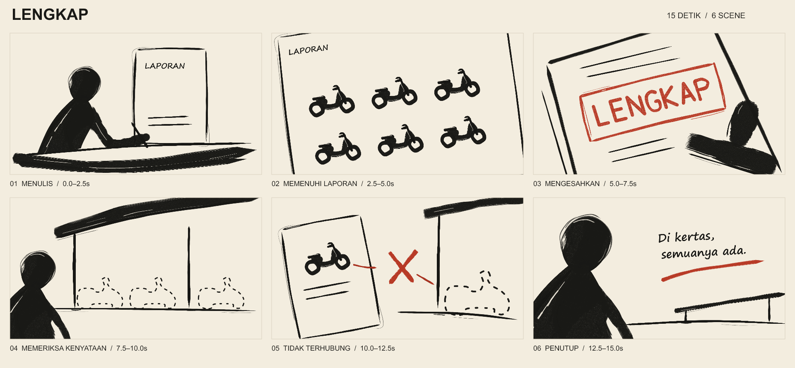

# Codeboard

**Draw with code. Keep the artwork editable. Render the film.**

Codeboard is a JavaScript/TypeScript toolkit for procedural drawing, storyboards, and 2D animation. Author strokes, layers, scenes, and timing through a public API; save an editable SQLite project; render stills, review sheets, and movies from the same artwork.

No account, AI service, or manual editor is required. It works with ordinary scripts and can be operated by coding agents.

[Get started](#try-it-locally) · [Documentation](docs/README.md) · [Examples](examples/README.md) · [Contributing](CONTRIBUTING.md)

[](https://github.com/nonomnonom/codeboard/blob/main/docs/media/lengkap.mp4)

**LENGKAP** — a 15-second procedural brush film. [Watch the MP4](https://github.com/nonomnonom/codeboard/blob/main/docs/media/lengkap.mp4) · [Read the source](examples/lengkap.ts). Its artwork uses editable strokes and text, not generated video or six animated still images.

## What you can make

- **Draw:** pressure-sensitive brush strokes, custom bitmap tips, vector paths, masks, clipping, and pixel edits.
- **Animate:** reusable frame-by-frame drawing sequences, holds and blanks, stroke write-on, layer/camera keyframes, transitions, and audio cues.
- **Revise:** transactions, undo/redo, named project revisions, and targeted storage updates.
- **Deliver:** PNG frames, storyboard sheets/PDFs, animatic packages, and MP4 through FFmpeg.

Codeboard is pre-1.0 software. It is not a replacement for a mature hand-drawing editor, a generative video model, or an emulator of Photoshop/Krita brush engines. API and storage changes need compatibility review. See [implemented behavior and limits](docs/architecture.md).

## Try it locally

Requires **Node.js 22.22+** and npm. Native rendering dependencies are installed by npm. FFmpeg is only needed for movie export.

```sh
git clone https://github.com/nonomnonom/codeboard.git
cd codeboard
npm ci
npm run build
npm run example:quickstart
```

Open `examples/output/quickstart/first-stroke.png`. The same folder contains `first-stroke.cboard`, an editable two-second project. Regenerating this example replaces its generated output; keep independent edits elsewhere.

```sh
node dist/src/cli.js preview examples/output/quickstart/first-stroke.cboard
```

The read-only preview runs on loopback. To export its animation, install FFmpeg and run:

```sh
node dist/src/cli.js movie examples/output/quickstart/first-stroke.cboard --output examples/output/quickstart/first-stroke.mp4
```

Use `--ffmpeg /path/to/ffmpeg` or `FFMPEG_PATH` when FFmpeg is not on PATH. On memory-constrained machines, set `SKIA_CANVAS_THREADS=2`. Font availability affects text rendering; see [setup and troubleshooting](docs/getting-started.md).

The npm package is named `codeboard-studio`. These instructions use the source checkout and do not assume it has been published to the registry. To use a locally built copy elsewhere: `npm install /absolute/path/to/codeboard`.

## A stroke is editable data

```js
import { StoryboardProject, brushes, catmullRom } from 'codeboard-studio';

const project = StoryboardProject.create({
  title: 'First stroke', width: 960, height: 540, frameRate: 24,
});
const panel = project.addScene('A mark').addShot('Close-up')
  .addPanel({ id: 'stroke', durationFrames: 48 });

panel.addRasterLayer('Ink').rasterStroke(catmullRom([
  { x: 150, y: 390, pressure: .2, time: 0 },
  { x: 420, y: 180, pressure: 1, time: 300 },
  { x: 800, y: 140, pressure: .1, time: 800 },
], 32), { ...brushes.cleanInk, size: 44 }, {
  seed: 12, reveal: { startFrame: 0, endFrame: 36 },
});

await project.save('first-stroke.cboard');
```

`time` is pen-input time in milliseconds; `reveal` uses global timeline frames. Completed strokes retain stable texture as time advances. `.cboard` stores editable structure and binary assets in SQLite, with revisions and integrity checks. It is not a folder of rendered frames or a renamed JSON dump.

## Explore further

| Start here | What it covers |
| --- | --- |
| [Quickstart source](examples/quickstart.mjs) | Draw, save, render, and preview a small project |
| [LENGKAP](examples/lengkap/README.md) | Six scenes, custom brushes, stamp impact, original Foley, and an isolated revision |
| [THE LAST LIGHT](examples/README.md#the-last-light) | A longer storyboard, reusable artwork, lighting, acting, and directed revision |
| [Authoring guide](docs/authoring.md) | Drawing, persistence, inspection, pen input, and CLI usage |
| [Agent review loop](docs/agent-workflow.md) | Coordinates, per-layer onion skin, pixel comparison and rejecting a trial |
| [Animation properties](docs/animation-channels.md) | Independent layer channels, stable keys and targeted timing edits |
| [Brush resources](docs/brush-resources.md) | Native tips and bounded import of external resources |
| [Gradient fills](docs/gradient-fills.md) | Editable linear/radial contour fills and local placement |
| [Storage](docs/storage.md) | SQLite design, partial reads, concurrency, and revisions |

## Contribute

```sh
npm run check
```

This builds the project, runs tests, checks documentation links, and verifies the packed public API and CLI. Movie integration tests require `FFMPEG_PATH`. A separate `npm run test:install` checks a real clean-directory installation and needs network access.

Bug reports should include a small reproduction and expected versus actual output. Visual changes should include rendered evidence. See [CONTRIBUTING.md](CONTRIBUTING.md), [the source map](docs/contributor-architecture.md), and [release preparation](docs/releasing.md).

## License

Code: [MIT](LICENSE). Original example artwork and synthesized audio: CC0-1.0. Dependencies, native libraries, fonts, and imported resources have their own terms; see [NOTICE](NOTICE). Report vulnerabilities through [SECURITY.md](SECURITY.md).
