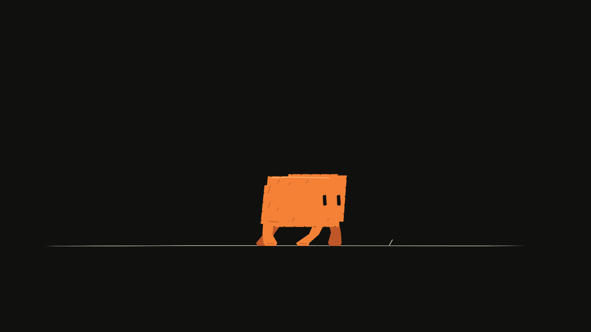
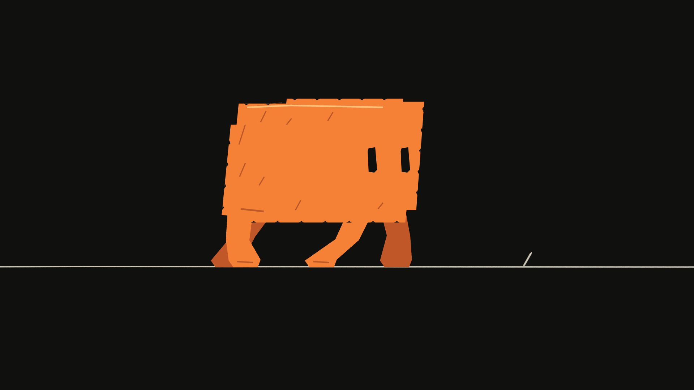

# Camera

Use camera keys to frame a shot independently of its artwork. Camera X/Y specify pan offsets from the original framing. At X=0, Y=0, and zoom=1, the canvas keeps its original framing. A larger zoom moves closer. Rotation uses radians.

```ts
const shot = project.addScene('Street').addShot('Push in');
const panel = shot.addPanel({ durationFrames: 72 });
project.production.addCameraKeyframe(shot.id, 0, {
  x: 0, y: 0, zoom: 1, rotation: 0, easing: 'ease-in-out',
});
const endKey = project.production.addCameraKeyframe(shot.id, 71, {
  x: 70, y: -30, zoom: 1.35,
});
```

The example assumes a 1280×720 project starting at frame 0. For later shots, use their global frame positions.

This page uses storyboard shots and global board frames. For an independent shot animation, use `camera.key.put` through [shot-local edits](shot-layers.md), with local frames and complete keyed channels.

## Revise the framing

<!-- study:camera-framing:start -->
**Move the view, keep the drawing.** How does a camera bring attention to one object?

[](../../website/public/art/guides/camera-framing.png)

Compare the window and lamp as the camera pans right and zooms in. Camera keys change the view of stationary artwork.

<!-- study:camera-framing:end -->





These images illustrate a camera-only correction. Continue with the `shot` and 72-frame `panel` created above; choose values that frame your own artwork:

```ts
project.production.addCameraKeyframe(shot.id, 36, {
  x: 60, y: 160, zoom: 2, rotation: 0,
});
```

Positive camera X moves the viewing position right, so artwork moves left in the frame; positive Y moves the viewing position down. Zoom is centered on the frame after pan. Zoom and root-plane depth must be positive.

```ts
project.production.updateCameraKeyframe(shot.id, endKey, { zoom: 1.6 });
console.log(project.production.cameraKeyframes(shot.id, { limit: 20 }));
```

Use `removeCameraKeyframe(shotId, keyId)` to delete a key. X, Y, zoom, and rotation interpolate independently, using the same easing choices as [layer animation](timing.md).

To remove only zoom from a mixed camera key, use `removeCameraKeyframeChannels(shotId, keyId, ['zoom'])`. Other channels on that key remain. Keys at the same frame merge supplied channels. A channel holds its nearest value before its first key and after its last key; unkeyed channels keep the default framing.

## Build depth

<!-- study:camera-depth:start -->
**Near objects slide faster.** How can a camera pan create a sense of depth?

[](../../website/public/art/guides/camera-depth.png)

Track the dark foreground shapes, then the blue background shapes. The camera moves once, but the near shapes travel farther across the frame. Depth changes apparent camera movement. The drawing coordinates remain fixed.

<!-- study:camera-depth:end -->

Give root layers different positive `depth` values to produce multiplane parallax when the camera moves. Depth 1 is the default plane; smaller values respond more strongly to camera movement and larger values less strongly. Keep foreground, character, and background artwork on separate root planes. A group's children remain on the group's plane.

```ts
const foreground = panel.addGroup('Foreground', { depth: .7 });
const background = panel.addGroup('Background', { depth: 2 });
```

Multiplane depth changes camera projection; it does not turn flat artwork into a 3D model. Render the start, middle, and end of a move to check framing and overlaps.

Use `production.setPlaneDepth(layerId, depth)` to change a plane later, or a layer key's `depth` channel to animate it. Projection uses pan divided by depth and zoom raised to `1 / depth`. Root layer order still controls overlap. Depth does not reorder layers or create perspective geometry.

## Evaluate without playback

```ts
import { evaluateCamera } from 'codeboard-studio';
const keys = project.production.cameraKeyframes(shot.id, { limit: 100 });
console.log(evaluateCamera(keys, 36));
```

Pass the full set of relevant keys when evaluating, including keys bracketing the requested frame. A truncated query can give a different interpolation result. Rendering a project evaluates its complete timeline automatically.

## Framing guides and isolated artwork

<!-- study:perspective-guides:start -->
**Draw toward a vanishing point.** Where should the floor lines meet?

[](../../website/public/art/guides/perspective-guides.png)

Compare the authored floor with the horizon and vanishing-point overlays. The guides help inspect a drawing. They do not generate perspective geometry or turn the scene into 3D.

<!-- study:perspective-guides:end -->

```ts
import { renderPanelPNG, renderCompositionGuides } from 'codeboard-studio';
import { writeFile } from 'node:fs/promises';
await writeFile('source-pose.png', await renderPanelPNG(project, panel.id, {
  frame: 36, camera: false, annotations: false,
}));
await writeFile('guides.png', await renderCompositionGuides(project, panel.id, {
  frame: 36, thirds: true, safeInset: .08, horizonY: 360,
  vanishingPoints: [{ x: 640, y: 360 }],
}));
```

Guides are review overlays; they do not modify the document. Horizon and vanishing-point positions are output-frame coordinates. `safeInset` is a fractional inset on each edge, not a named broadcast-safe standard. Layer isolation respects its hierarchy; a hidden ancestor can still hide the selected artwork.

## Inspect a camera frame

```ts
import { renderFramePNG } from 'codeboard-studio';
import { writeFile } from 'node:fs/promises';
await writeFile('camera-check.png', await renderFramePNG(project, 36));
```

Frame rendering evaluates both the camera and artwork animation. A panel drawing and a camera-framed timeline image serve different review tasks; use exact frame renders for timing decisions.
