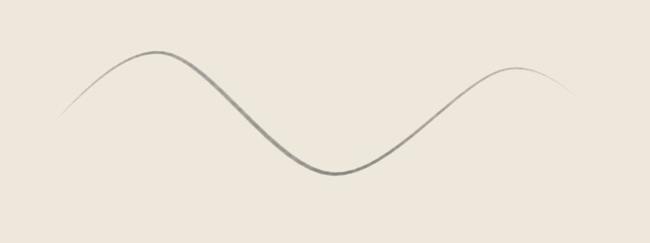
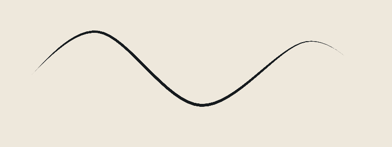
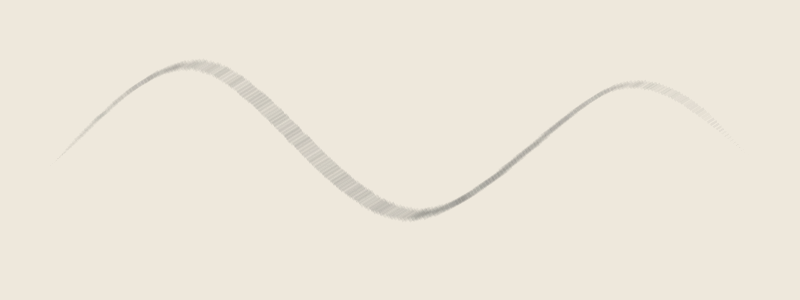

# Brushes

A brush combines a tip, settings, and optional paper texture. A tip describes the stamped shape; settings control spacing, size, opacity, taper, and dynamics. The Codeboard brush engine paints those stamps along your path.

<!-- study:brush-dynamics:start -->
**Let pressure shape the stroke.** What does pen pressure change?

[](../../website/public/art/guides/brush-dynamics.png)

Compare the width at the ends and middle, then look for separate brush stamps. Pressure response and stamp spacing affect the same recorded gesture differently.

<!-- study:brush-dynamics:end -->

## Customize a preset

```ts
import { brushes, customizeBrush, renderBrushSwatch } from 'codeboard-studio';
import { writeFile } from 'node:fs/promises';

const pencil = customizeBrush(brushes.roughPencil, {
  id: 'brush:soft-pencil', name: 'Soft pencil', size: 18,
  opacity: .65, spacing: .15,
  dynamics: { pressureSize: .8, pressureOpacity: .6 },
});
await writeFile('pencil-swatch.png', await renderBrushSwatch(pencil));
```

Built-in presets are `roughPencil`, `cleanInk`, `shadeBrush`, `charcoal`, and `softEraser`. Customize a copy rather than changing a shared definition.

The same pressure-varying curved path, rendered with three settings:







The third swatch uses `customizeBrush(brushes.charcoal, { texture: 'dry-brush', textureStrength: .75 })`. [BrushPreset and BrushDynamics](../reference/api/types.md) describe the complete fields; [brush functions](../reference/api/drawing.md) list import and swatch calls.

| Setting | Effect |
| --- | --- |
| `size` | Tip width in canvas units |
| `opacity`, `flow` | Paint transparency and accumulation |
| `hardness` | Tip edge falloff |
| `spacing` | Distance between stamps, relative to brush size |
| `taperStart`, `taperEnd` | Narrow the stroke near its ends |
| `tip.rotationMode` | Fixed, path-following, or stylus orientation |
| `texture`, `textureStrength` | Procedural graphite, charcoal, or dry-brush texture |
| `paperTexture` | A repeating bitmap texture attached to the artwork |
| `dynamics` | Responses to pressure, speed, tilt, and rotation jitter |

Use `brushParameterSchema` to inspect the full preset structure as JSON Schema. Set an explicit stroke `seed` when using randomized texture or rotation jitter.

## Import a bitmap tip

For preset dependencies, texture resources, and selecting among several tips, use the [resource import guide](import-brushes.md).

```ts
import { importBrushResource, brushFromResource } from 'codeboard-studio';

const report = await importBrushResource('my-tip.png', {
  maskMode: 'alpha', maxTipSize: 256,
  origin: {
    source: 'My painted tip', author: 'Me',
    license: 'CC0-1.0', redistribution: 'allowed',
  },
});
console.log(report.missingDependencies, report.unsupported, report.warnings);
if (!report.resources.length) throw new Error('No usable tip in this resource');
const brush = brushFromResource(report.resources[0], {
  ...brushes.cleanInk, id: 'brush:painted-tip', name: 'Painted tip', size: 64,
});
await writeFile('tip-swatch.png', await renderBrushSwatch(brush));
```

Use `alpha` for transparent PNG tips, or `luminance` / `inverse-luminance` to derive a mask from brightness. A bitmap tip uses the stroke's chosen color; it does not paint the original RGB image as a color stamp. `maxTipSize` controls import resolution, with a maximum of 512 pixels; review any resize warning before using the brush.

## External resource support

| Format | What you can use |
| --- | --- |
| PNG | Bitmap alpha or brightness masks |
| GBR | GIMP v1/v2 grayscale and RGBA tips |
| GIH | Individual GBR cells; choose the cell to use |
| ABR | Sampled 8-bit tips from v1/v2 and v6.1/v6.2 |
| KPP | Preset metadata, supported settings, and resolved embedded or linked tips |
| BUNDLE | Supported brushes, patterns, and presets inside a Krita resource bundle |

Read the import report before painting. Foreign engine behavior is not reproduced automatically. GIH cell-selection behavior, computed ABR tips, and many Photoshop/Krita dynamics are unsupported. A KPP preview image is not used as a brush tip. Missing dependencies remain reported rather than being replaced with a round brush.

Record the actual source and license of resources you import. Only set `redistribution: 'allowed'` when you have permission to distribute the resource.

## Create a custom bitmap tip

```ts
import { brushTipFromFunction } from 'codeboard-studio';
const tip = brushTipFromFunction(96, 96, (x, y) => {
  const edge = .55 + .12 * Math.sin(y * 13) + .06 * Math.cos(y * 29);
  const silhouette = Math.max(0, Math.min(1, (edge - Math.abs(x)) * 14));
  const ends = Math.max(0, 1 - Math.abs(y) ** 4);
  const fibers = .45 + .55 * Math.abs(Math.sin(x * 43 + y * 5));
  return silhouette * ends * fibers;
}, { rotationMode: 'stroke' });
const fiberBrush = customizeBrush(brushes.cleanInk, {
  id: 'brush:fibers', name: 'Fibers', tip, size: 64, spacing: .12,
});
await writeFile('fibers.png', await renderBrushSwatch(fiberBrush));
```

The callback receives normalized X/Y coordinates from -1 to 1 and returns alpha from 0 to 1. The result is a bitmap tip; it can be saved with the preset and artwork. This example deliberately shapes its edge and fibers without random line jitter. PNG and external resources can supply nonprocedural painted tips instead.

## Pen dynamics and orientation

| Input | Meaning |
| --- | --- |
| `pressure` | Normalized 0–1 pressure, affecting enabled size/opacity/spacing/hardness responses |
| `time` | Nonnegative pen milliseconds; nondecreasing samples drive speed responses |
| `tiltX`, `tiltY` | Stylus tilt in degrees, -90 to 90, used by the supported tip-shape response |
| `rotation` | Stylus orientation in radians for stylus-following tips |
| Stroke `seed` | Reproducible texture/jitter choices for that stroke |

`fixed` tip rotation keeps its angle, `stroke` follows path direction, and `stylus` uses supplied orientation. Missing timestamps receive generated timing. Use explicit timestamps when velocity is part of your brush design. Parameters describe this engine's behavior, not a physical paint or pencil simulation.

## Save and reuse a brush

```ts
const brushId = project.production.createBrush(brush);
const savedBrush = project.production.brush(brushId);
panel.addRasterLayer('Paint').rasterStroke(points, savedBrush);
project.production.reviseBrush(brushId, { size: 90 });
```

Saving the project stores its brush definitions and tip data. Revising a library brush affects future strokes; existing strokes keep their recorded brush settings. Use an explicit stroke edit when you want older paint to use a different brush.

`duplicateBrush(id, name)` creates a separately editable preset. `brush(id)` reads its current definition. `brushParameterSchema` is a JSON Schema object, not a parser with a `.parse()` method. It describes ranges and supported enumerations for inspection or use with a JSON Schema validator. `production.createBrush(definition)` validates a complete preset when adding it to the project. Successful validation does not establish that the swatch looks right—render it.
