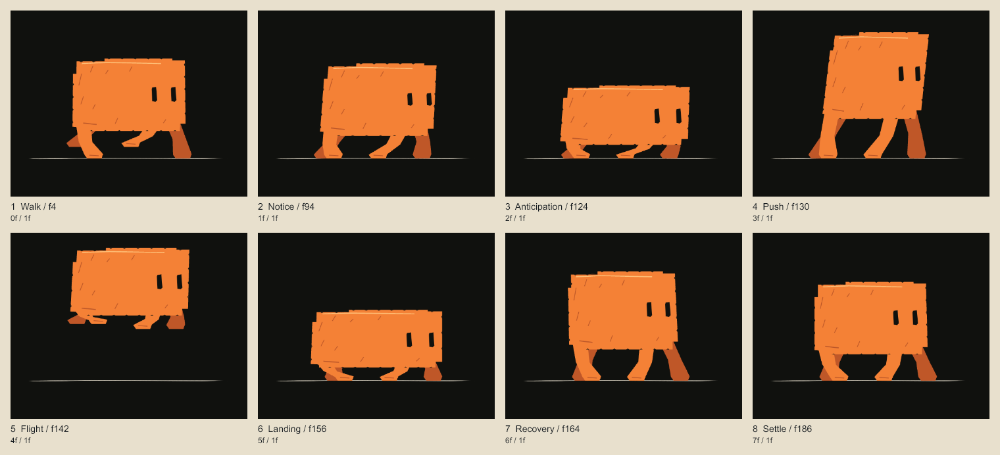

# Codeboard

Draw, build storyboards, and animate with JavaScript or TypeScript. Give your coding agent a brief, let it run Codeboard, then review the images and ask for revisions.

Codeboard runs on your computer with Node.js 22.22 or later. Install the CLI and library from npm; no npm account or AI service is required.

## Start a project

Follow [the Codeboard demo](code-board-demo.md) from pose construction to exposures, onion skins, a timing revision, and an exported film. Download its source and editable project, then run the same code locally.

1. [Install Codeboard](install.md) on Windows, macOS, or Linux.
2. [Create your first drawing](quickstart.md) and render a PNG.
3. [Review and revise](review.md) the saved artwork.

New to the object model? Read [how a project works](concepts.md). For typed source, use the complete [TypeScript setup](typescript.md), including dependency installation, compiler configuration, execution and validation.

Using a coding agent? [Install the Codeboard skills](agent-plugin.md) for operation guidance and an offline API reference, with plugin and portable-folder setup for compatible hosts.

## Learn by comparing results

[Run the visual studies](visual-examples.md) to compare clipping, feathering, drawing changes, component reuse and IK. Each figure has reproducible source and an editable project output.

## Create artwork

Use [drawing tools](drawing.md) for pressure-sensitive strokes, curves, contours, and pixels. Make [custom brushes](brushes.md) from your own tips or imported brush resources. Organize a panel with [layers, groups, and masks](layers.md).

## Build a sequence

Arrange scenes, shots, and panels in a project. Add [drawing changes and keyframes](animation.md), control the [camera](camera.md), and place [audio](audio.md). Export [storyboard sheets or a movie](export.md) when you are ready to share.

## Keep working

A `.cboard` file keeps the editable artwork, timeline, brushes, and assets together. Use [projects and revisions](projects.md) to reopen work in another session. The [CLI reference](cli.md) lists terminal commands; the [API guide](reference.md) maps common tasks to code.

For an agent-led session, use [the author → review → revise workflow](agent-workflow.md). For exact calls and object shapes, browse the [project](api-project.md), [production](api-production.md), [drawing](api-drawing.md), [rendering](api-render.md), [storage](api-storage.md), and [type](api-types.md) references.
