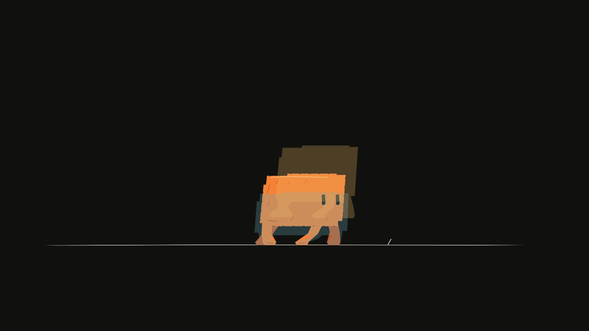

# Onion skin, layer by layer

Onion skin combines rendered samples from specified frames, panels, and layers. Use it to compare contact, spacing, arcs, and pose changes without flattening or modifying the artwork.



This image comes from the [downloadable demo](code-board-demo.md). The current scene is opaque; earlier character artwork is blue and later artwork is amber.

## Render a current frame and two neighbors

Save this as `onion.mjs` beside the extracted demo source, after running `main.mjs`:

```js
import { writeFile } from 'node:fs/promises';
import { StoryboardProject, renderOnionSkin } from 'codeboard-studio';

const project = await StoryboardProject.open('clawd-output/clawd.cboard');
await writeFile('clawd-output/onion-detail.png', await renderOnionSkin(project, [
  { panelId: 'performance', frame: 128 },
  { panelId: 'performance', frame: 124, layerIds: ['clawd'],
    tint: '#69aeba', opacity: .28 },
  { panelId: 'performance', frame: 132, layerIds: ['clawd'],
    tint: '#e9b364', opacity: .28 },
], { camera: false }));
```

Run `codeboard run onion.mjs`. A group ID includes its selected descendant artwork and parent transforms. Here `clawd` isolates the performance, leaving the ground present only in the first sample. You can select several layer IDs in one sample, or use separate samples to give different parts distinct opacity or tint.

## Choose neighboring drawings rather than arbitrary frames

```js
const neighbors = project.production.drawingNeighbors('clawd', 128);
console.log(neighbors.previous, neighbors.current, neighbors.next);
```

Each interval gives `drawingId`, `startFrame`, and exclusive `endFrame`. Consecutive references to the same drawing form one held interval. Previous/next skip blank intervals by default; pass `{ skipBlank: false }` to include them. Use the neighbors' start frames when you want the adjacent drawing, rather than `frame - 1`, which may still be the current held cel.

A previous or next neighbor can be `null` at an endpoint. Only request neighbors for a frame inside the track's owning panel. Onion rendering itself takes your explicit samples; it does not decide the artistic spacing for you.

## Compare panels

Give samples different `panelId` values to compare matching artwork in two panels. All sampled panels must have the same dimensions. Omit `layerIds` to render the whole panel; provide IDs from each panel when isolating characters or props. IDs from one panel are not automatically valid in another.

## Camera and opacity rules

| Option | Behavior |
| --- | --- |
| `camera: false` | Default. Compare layer placement without camera framing |
| `camera: true` | Include each sample's camera evaluation and multiplane projection |
| `sample.opacity` | Explicit opacity for that sample, from 0 to 1 |
| `options.opacity` | Default overlay opacity, `.3` |
| First sample without explicit opacity | Full opacity |
| Later sample without explicit opacity | Uses the default overlay opacity |
| `sample.tint` | Replace visible color with a tint while retaining alpha |
| `sample.layerIds` | Nonempty list of layer/group IDs to isolate |

You may combine one to eight samples. Samples paint in the order supplied. Tinted or layer-isolated samples use a transparent background so a ghost does not cover the current scene with a second background.

Camera-off comparison still includes layer animation. To compare geometry at a common origin, arrange a separate pose sheet like the demo's key-drawing study. Onion skins are review images and do not create new timeline artwork.

## Review the right question

For foot contact, compare the soles against a fixed ground line. For flight, compare the body center and limb silhouette. For a camera move, use camera-on samples or a [frame sheet](review.md). A dense stack of ghosts can obscure a drawing; isolate the relevant layer and reduce the number of samples.
