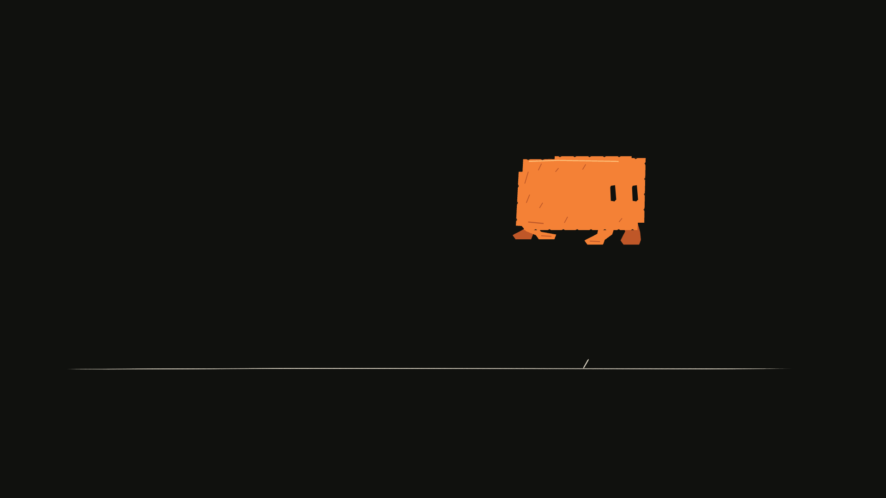
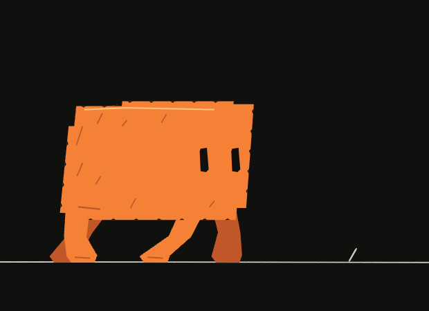
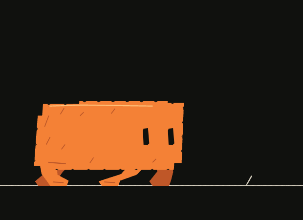

# Animate the Codeboard demo

Build the eight-second Clawd performance from the Codeboard launch demo: walk, notice an obstacle, gather weight, hop, land, and settle. The example uses editable vector drawings, pencil accents, drawing exposures, and separate placement keys.



The [48-second walkthrough film](../../website/public/art/code-board-demo/walkthrough.mp4) shows the larger workflow. Its terminal scenes are a scripted presentation, not a live agent recording. The film is rebuilt with the released CLI and original synthesized Foley. Download the complete presentation source below, or begin with the smaller eight-second performance. Neither requires external artwork or audio.

These story and presentation choices belong to this example. They do not define required style, character anatomy, production stages, or agent behavior. Assertions cover named fixture properties; visual quality remains a separate review.

## Run the example

Download [the complete source ZIP](../../website/public/art/examples/code-board-demo.zip). Inside the extracted `code-board-demo` directory:

```sh
npm install
npm run typecheck
npm run author
npm run revise
npm run render
```

The single [demo project](README.md) contains the character study and the presentation. Its `character/` source is shared, not copied. The short study writes `output/clawd.cboard` and review images. Authoring refuses to replace an existing project; choose a new output directory for another generation. Revision opens saved state and rendering preserves it.

For repository development, follow the [example workspace instructions](../README.md). Downloads use the matching release; local workspace development uses the live checkout.

## Build the presentation

```sh
npm run presentation:author
npm run presentation:verify
npm run presentation:render
```

`presentation:author` builds and checks the scripted presentation. `presentation:render` opens the saved film and exports an MP4; it requires FFmpeg. Presentation outputs are under `output/presentation/`, or `CODEBOARD_DEMO_OUTPUT`. Assertions test this fixture's timing and geometry, not general artistic quality or autonomous agent behavior.

## Separate shape from placement

The source separates shared character data, authoring, commands and review:

| File | Responsibility |
| --- | --- |
| `src/character/poses.ts` | Body proportions, feet, eyes, and the ordered performance exposures |
| `src/character/art.ts` | Convert a pose into editable contours and ink accents |
| `src/study/main.ts` | Build the project, select drawings, key placement, save and render |
| `src/cli/revise.ts` | Open the project and change a specific drawing hold |

`drawClawd(panel, pose, options)` is an example-specific drawing function, not an engine primitive. It creates groups and vector paths through the same public API used in your own scripts. Width, height, lean, eye opening, gaze, and four foot positions shape a drawing. A parent track controls where that drawing appears in the scene.

Changing the drawing makes the body compress or the feet tuck. Changing its track transform moves the character across the frame. These are separate decisions.

## Design the performance


This pose sheet places the drawings side by side for inspection. The downloaded `poses.png` instead samples their actual positions across the scene.

| Local frames | Action | Drawing decision |
| --- | --- | --- |
| 0–71 | Walk | Repeat a 12-drawing walk cycle on twos |
| 72–89 | Stop | Bring forward movement to rest while feet find support |
| 90–111 | Notice | Lean and gaze toward the obstacle; hold the thought |
| 112–127 | Anticipate | Widen and lower the body before the push |
| 128–151 | Take off and fly | Stretch, tuck the feet, then extend toward landing |
| 152–175 | Land and recover | Contact, compression, rebound, settle |
| 176–191 | Finish | Hold the settled drawing and blink |

An exposure can reuse an existing drawing. The walk repeats geometry without creating a fresh copy at every frame. The held notice pose is also one drawing, not a sequence of identical snapshots.

## Create the drawing track

The project uses stable IDs for the panel (`performance`), stage (`stage`), and drawing track (`clawd`). Individual drawing groups receive IDs when created; the example records them in a map.

```ts
const track = panel.addGroup('Clawd drawings', { id: 'clawd' }, stage.id);
const drawings = new Map<string, string>();
for (const [name, pose] of acting.drawings) {
  drawings.set(name, drawClawd(panel, pose, {
    parent: track.id, name,
  }).id);
}
project.production.setDrawingSequence(track.id,
  acting.exposures.map(({ frame, id }) => {
    const drawingId = drawings.get(id);
    if (!drawingId) throw new Error(`Unknown drawing ${id}`);
    return { frame, drawingId };
  })
);
```

Each exposure holds until the next. `drawingId: null` would create a blank exposure. The engine selects the authored drawings; it does not invent intermediate poses.

## Place each drawing

```ts
for (const { frame, x, y } of acting.exposures) {
  project.production.addLayerKeyframe('clawd', frame, {
    transform: { x, y }, easing: 'hold',
  });
}
```

Hold interpolation keeps placement synchronized with the drawings on twos. Using continuous movement here would slide a held foot between drawings. The airborne path is authored as `x = 846 + 390u` and `y = -185 × 4u(1-u)`, with `u` running from takeoff toward landing. The pose function separately redraws the body and feet along that path.

## Compare neighboring drawings


```ts
const image = await renderOnionSkin(project, [
  { panelId: 'performance', frame: 128 },
  { panelId: 'performance', frame: 124, layerIds: ['clawd'],
    tint: '#69aeba', opacity: .28 },
  { panelId: 'performance', frame: 132, layerIds: ['clawd'],
    tint: '#e9b364', opacity: .28 },
]);
```

The first sample provides the current scene. Later samples isolate the character, so the ground is not duplicated. Compare the feet against the ground, the body arc, and the distance traveled between exposures. See [review](../../docs/workflow/review.md) for crops and coordinate mapping.

## Revise the anticipation

Run the included revision script after authoring:

```sh
npm run revise
```

It extends the anticipation drawing into frames 126–129. Frame 128 changes from a push pose to the held crouch; frame 130 resumes the existing takeoff. Total duration stays at 192 frames. Placement keys are unchanged: this is a drawing-hold revision, not a retime of the entire motion.

```ts
project.transaction('Hold the anticipation for two more frames', () => {
  const { current } = project.production.drawingNeighbors('clawd', 124);
  if (!current?.drawingId) throw new Error('Anticipation drawing is missing');
  project.production.setDrawingRange('clawd', 126, 130, current.drawingId);
});
await project.save('output/clawd.cboard');
```

Before, frame 128:



After, the same frame:



For a longer shot that shifts later material, use `setPanelDuration` with ripple timing instead. For a contour correction, edit the specific vector element. [Projects and revisions](../../docs/workflow/projects.md) explains how to preserve a checkpoint and recover a rejected change.

## Export the movie

With FFmpeg available:

```sh
npx codeboard movie output/clawd.cboard --output output/clawd.mp4
```

Inspect the full eight-second playback, especially planted feet, the pause before the hop, and the landing. Keep the `.cboard` file alongside the movie; the movie does not retain editable drawings.
