# See what changes

Small visual lessons in drawing, motion and delivery. Start with a question, compare the pictures, then try one change yourself.

Asset index for maintainers. The rendered comparisons appear directly in the relevant Fumadocs feature guides.

The chapters below follow a learning order. Source links below reproduce each rendered comparison.

## Marks, edges and color

Start with a still image. Compare the edge, the fill and the way a change spreads.

### One gesture, different materials

What changes when you draw with a brush, a vector or pixels?

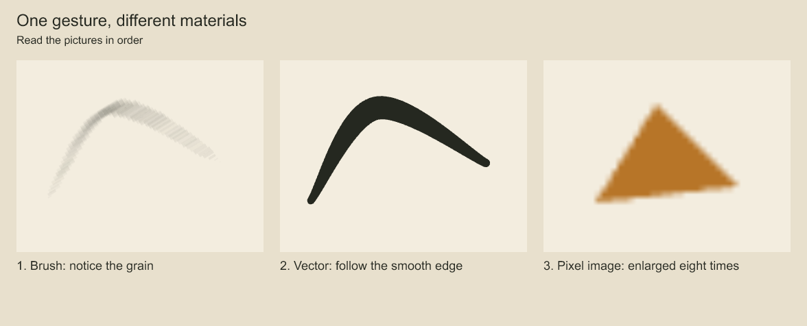

**Look for:** Compare the grain of the first stroke with the smooth edge of the second. The third picture enlarges a tiny pixel triangle; scaling softens its low-resolution edge.

The brush and vector use the same pen path. The pixel triangle is a separate drawing that shows a different editing material.

**Try:** Change the brush size from 34 to 60. Then change only the vector width and compare their edges.

[Read the source](src/studies/drawing/representations.ts)

### Keep the paint inside

How do you stop a highlight spilling outside a shape?

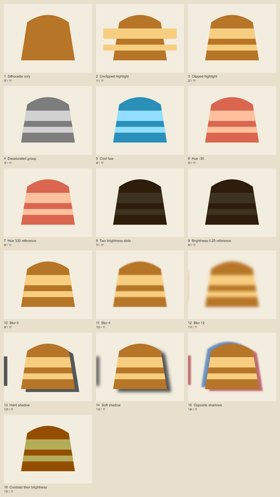

**Look for:** Follow the pale stripes across the outer edge. In the last image, the overflow disappears while the coat stays the same.

Clipping uses the layer below as the boundary. You can keep moving the highlight without redrawing that boundary.

**Try:** Move one stripe upward. Compare it with clipping off and on.

[Read the source](src/studies/drawing/clipping.ts)

### A sharp edge or a soft edge

What does feathering change?

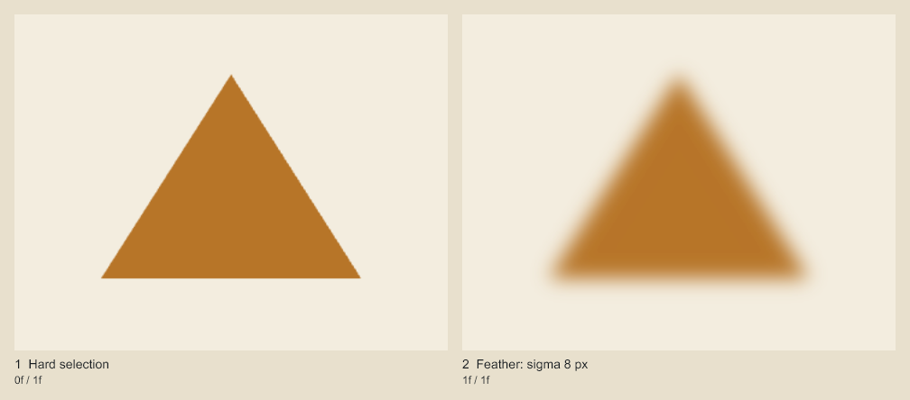

**Look for:** Look at the triangle's outline. The second fill fades out around the same selection boundary.

Feathering changes how much paint reaches the edge; it does not replace the triangle with a new shape.

**Try:** Change the feather amount from 8 to 16 source pixels and compare the edge.

[Read the source](src/studies/drawing/selections.ts)

### Recolor a group, keep one exception

Can one color change update several objects?

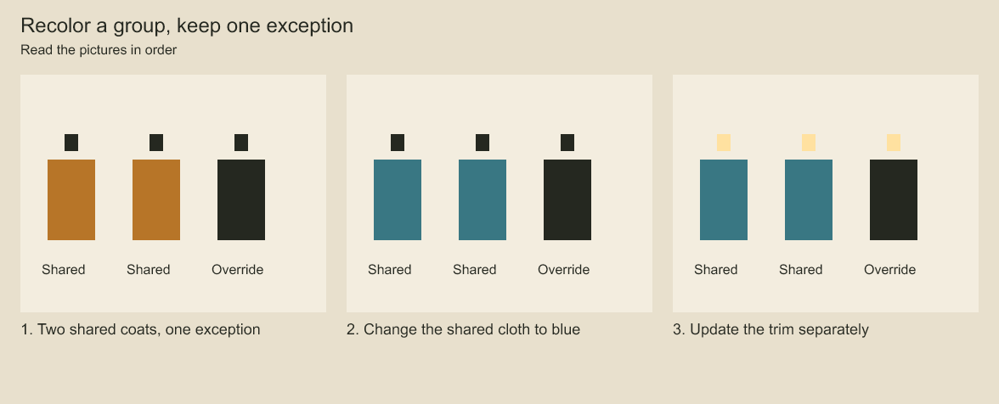

**Look for:** The two shared coats turn blue together. The dark coat keeps its own color. In the final step, the trim changes separately.

A shared swatch connects colors. A local override lets one object remain different.

**Try:** Change the cloth swatch to red. Leave the third coat's override alone.

[Read the source](src/studies/drawing/palettes.ts)

### Bring colors into the same workspace

Why inspect color when importing an image?

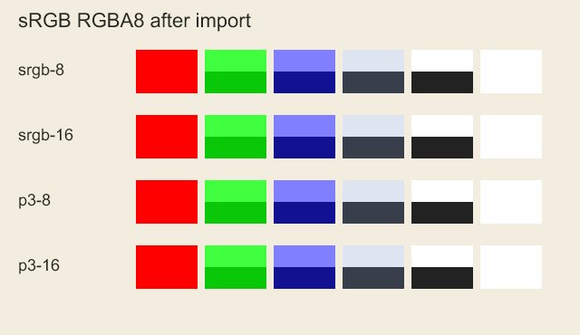

**Look for:** Each row shows an imported swatch against light and dark backgrounds. Compare the color and the transparent portions, not the row names alone.

Source profiles and bit depth describe input pixels. Import converts these examples to editable sRGB pixels.

**Try:** Open the two PNG fixtures beside the generated image. Compare the translucent edges on both backgrounds.

[Read the source](src/studies/drawing/color-import.ts)

## Color, construction and surface

Keep the drawing fixed while changing one rendering choice.

### Change overlap and parent space

Why does moving a layer in the hierarchy change its picture?

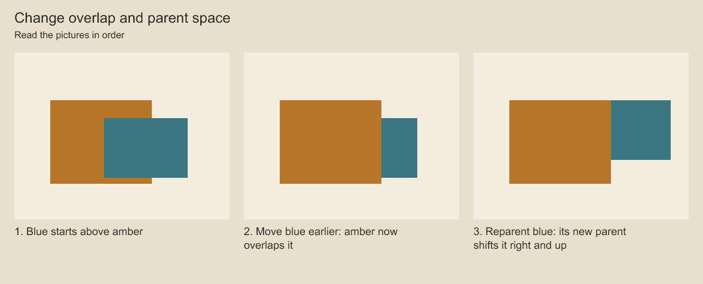

**Look for:** Blue first covers amber, then goes behind it, then shifts with an offset parent.

Stack order controls overlap. Reparenting also changes the coordinate space.

**Try:** Move the parent without editing the blue card coordinates.

[Read the source](src/studies/drawing/layer-order.ts)

### Turn a stroke into editable geometry

When should a stroke become a contour?

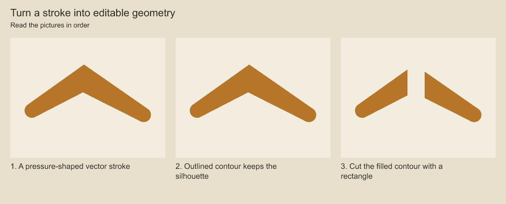

**Look for:** The first two silhouettes match; the final one has a rectangle cut out.

Outlining preserves the shape but replaces stroke-width editing with contour editing.

**Try:** Change the rectangular cutting path after outlining.

[Read the source](src/studies/drawing/stroke-outline.ts)

### Use an imported shape as a brush tip

How does a PNG become a repeating mark?

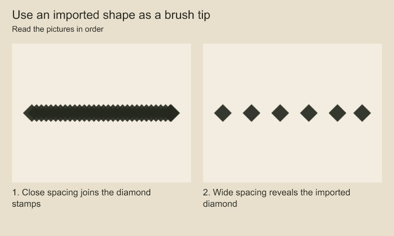

**Look for:** Compare close and wide spacing with the same diamond-shaped tip.

This study authors a PNG locally, imports its alpha, then uses Codeboard brush settings. It does not emulate a foreign brush engine.

**Try:** Edit the diamond PNG construction and reimport the resource.

[Read the source](src/studies/drawing/brush-import.ts)

### Reveal artwork through a mask

How can you move a boundary without moving the paint?

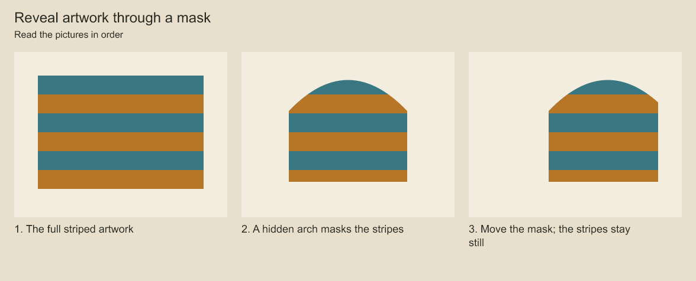

**Look for:** The arch moves right while the stripes stay in their original positions.

A mask supplies alpha coverage from another layer, including a hidden layer.

**Try:** Change the mask shape and keep the striped layer unchanged.

[Read the source](src/studies/drawing/masks.ts)

### Draw toward a vanishing point

Where should the floor lines meet?

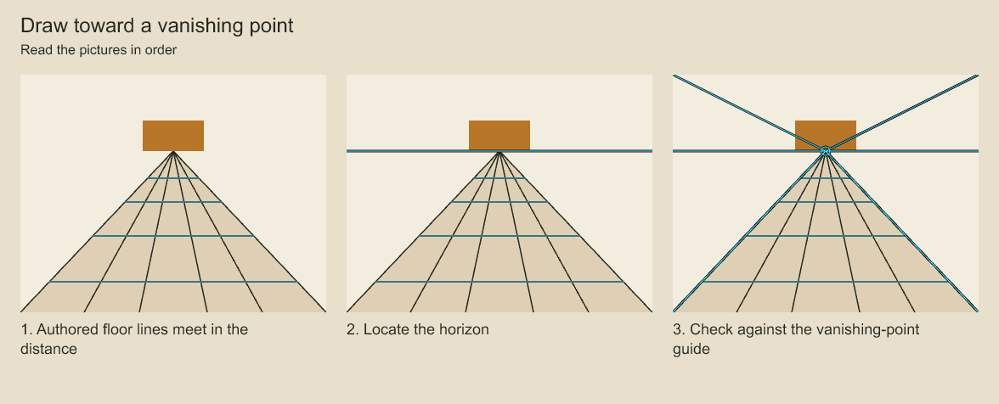

**Look for:** Compare the authored floor with the horizon and vanishing-point overlays.

The guides help inspect a drawing. They do not generate perspective geometry or turn the scene into 3D.

**Try:** Move the vanishing point and redraw the floor lines to match.

[Read the source](src/studies/drawing/perspective-guides.ts)

### Shape a fill with color

How can a flat contour suggest volume?

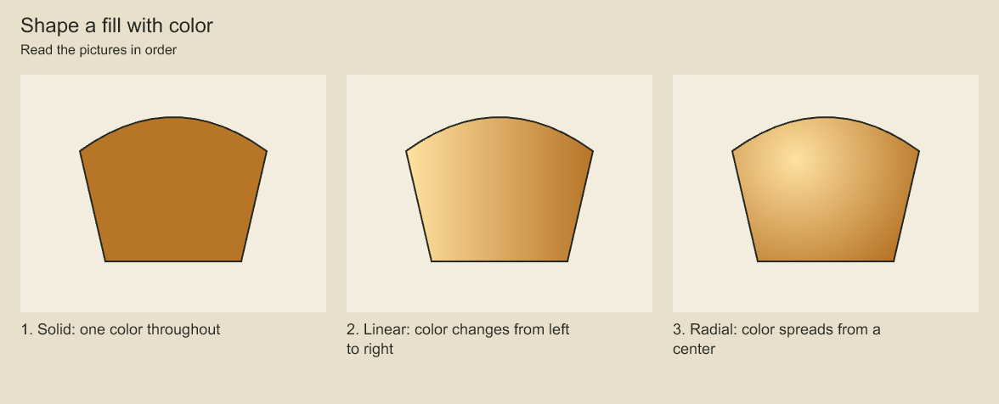

**Look for:** The contour stays fixed while the color becomes directional, then radial.

A gradient changes the fill inside an existing shape.

**Try:** Move the radial center toward the lower right.

[Read the source](src/studies/drawing/gradient-fills.ts)

### Build a shape from two shapes

What remains when two shapes overlap?

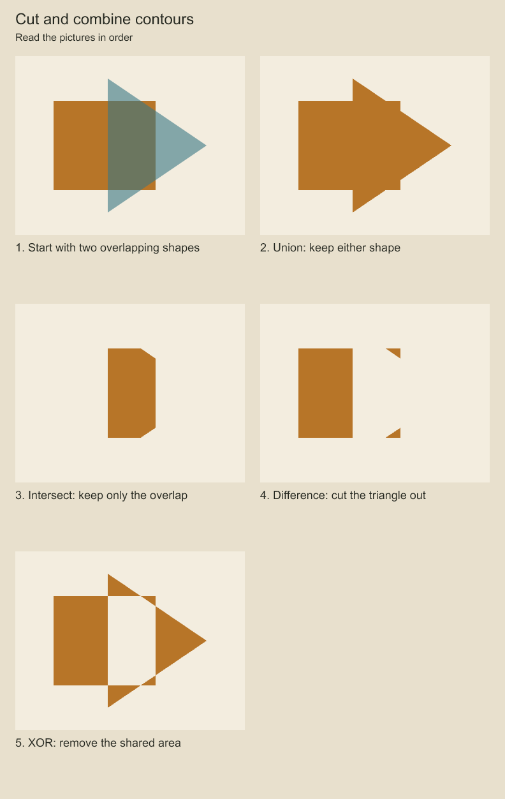

**Look for:** Compare the overlap with union, intersection, difference and exclusive-or.

Boolean operations create new path geometry from the same two inputs.

**Try:** Move the triangle and compare the intersection again.

[Read the source](src/studies/drawing/vector-booleans.ts)

### Let pressure shape the stroke

What does pen pressure change?

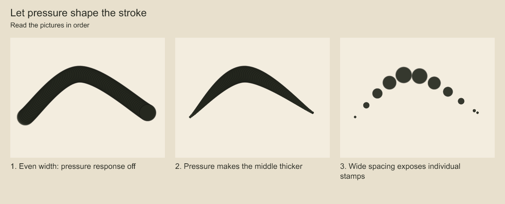

**Look for:** Compare the width at the ends and middle, then look for separate brush stamps.

Pressure response and stamp spacing affect the same recorded gesture differently.

**Try:** Reduce stamp spacing while keeping the pressure samples unchanged.

[Read the source](src/studies/drawing/brush-dynamics.ts)

### Change the appearance of a layer

What happens when you apply one effect at a time?

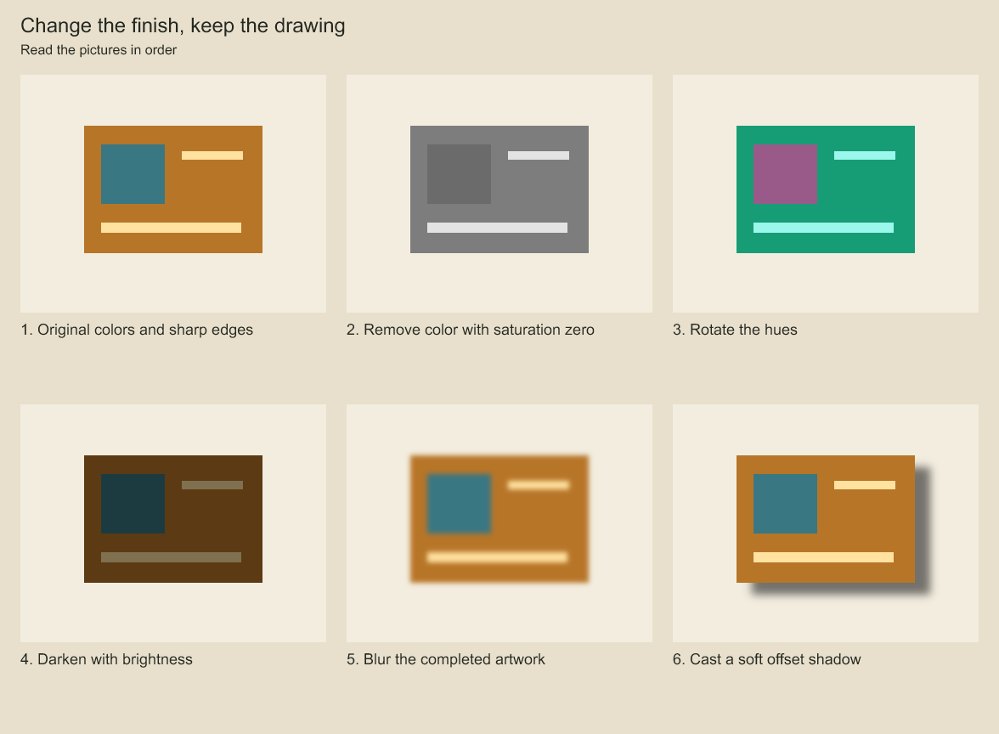

**Look for:** Compare the original colors and edges with each labeled effect.

Effects change rendered appearance while preserving source artwork.

**Try:** Apply blur before shadow, then reverse their order.

[Read the source](src/studies/drawing/layer-effects.ts)

### Mix overlapping colors

How does the upper layer combine with the lower one?

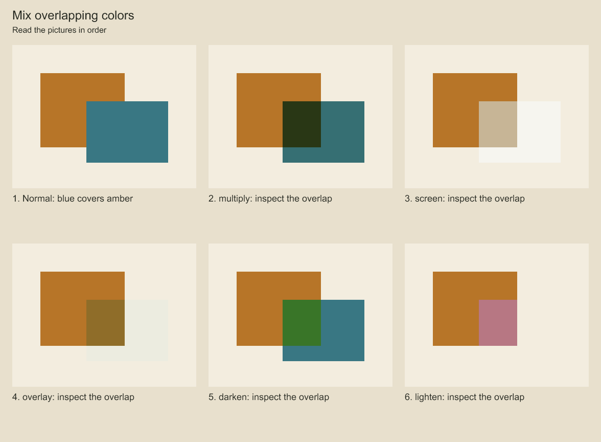

**Look for:** Compare the central overlap and the exposed blue area against the paper background. The geometry stays fixed.

A blend mode combines source and destination colors, including the scene background. Its result depends on both.

**Try:** Swap the blue and amber layer order.

[Read the source](src/studies/drawing/blend-modes.ts)

## Time, framing and review

Compare positions at known frames before watching the motion.

### Compare the change between pictures

How does one picture give way to another?

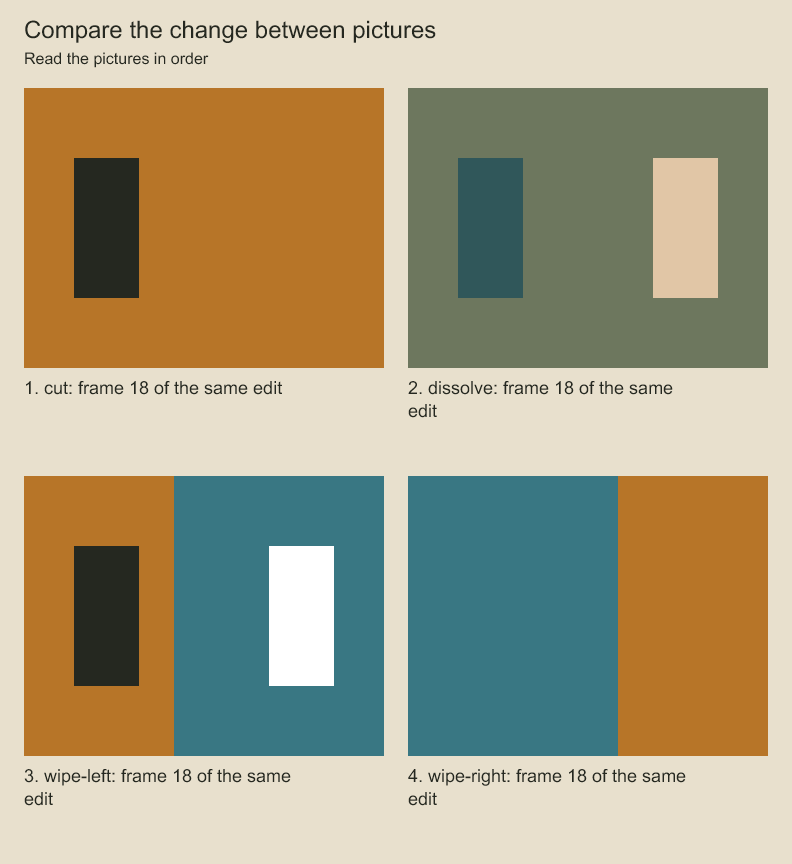

**Look for:** Compare the same edit frame under cut, dissolve and the two wipe directions.

A transition changes how adjacent pictures combine over time.

**Try:** Move the sampled frame nearer the beginning and end of the transition.

[Read the source](src/studies/animation/transitions.ts) · [Play the clip](../../website/public/art/guides/transitions.mp4)

### See neighboring poses together

Is the motion moving along the intended path?

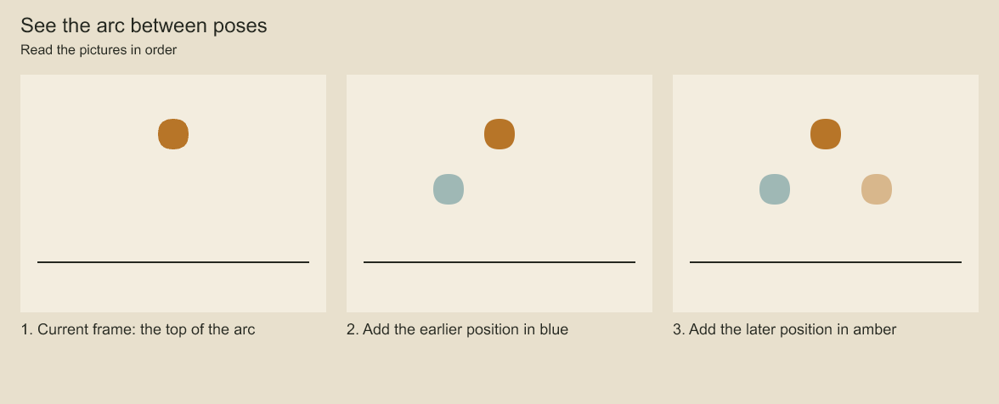

**Look for:** The solid ball is current. Blue shows an earlier position and translucent amber shows a later one.

Onion skins are review overlays; the exported animation contains only the current ball.

**Try:** Choose frames closer to the current frame and compare the spacing.

[Read the source](src/studies/animation/onion-skin.ts) · [Play the clip](../../website/public/art/guides/onion-skin.mp4)

### Compare the pace between keys

Can the same endpoints produce different movement?

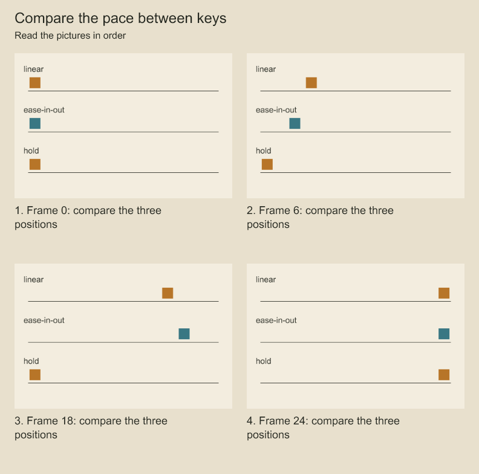

**Look for:** Compare the three markers at the same numbered frame. The hold marker waits until its final key.

Easing changes progress between keys without changing their endpoints.

**Try:** Replace ease-in-out with ease-in and compare the first quarter.

[Read the source](src/studies/animation/easing.ts) · [Play the clip](../../website/public/art/guides/easing.mp4)

### Choose where rotation happens

Why does the same angle move an object differently?

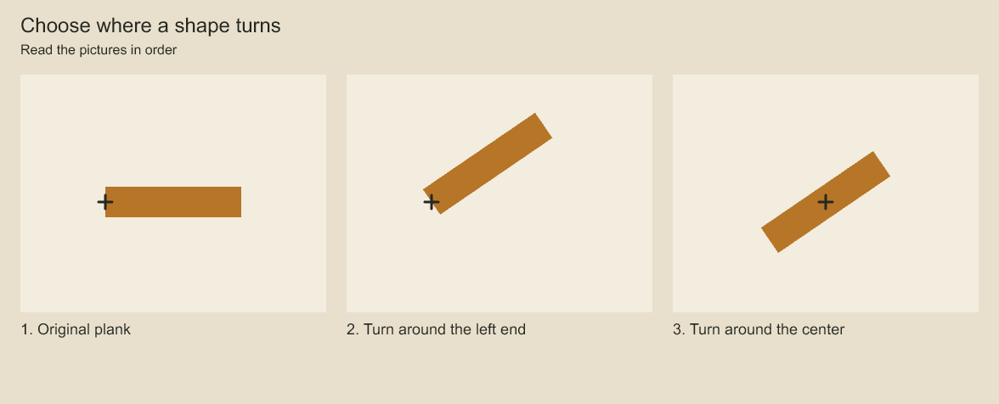

**Look for:** Follow the cross marking the rotation center as the plank turns.

The pivot determines the point around which the layer rotates.

**Try:** Move the pivot to the far end of the plank.

[Read the source](src/studies/animation/pivots.ts)

### Draw a stroke over time

How does a finished gesture appear gradually?

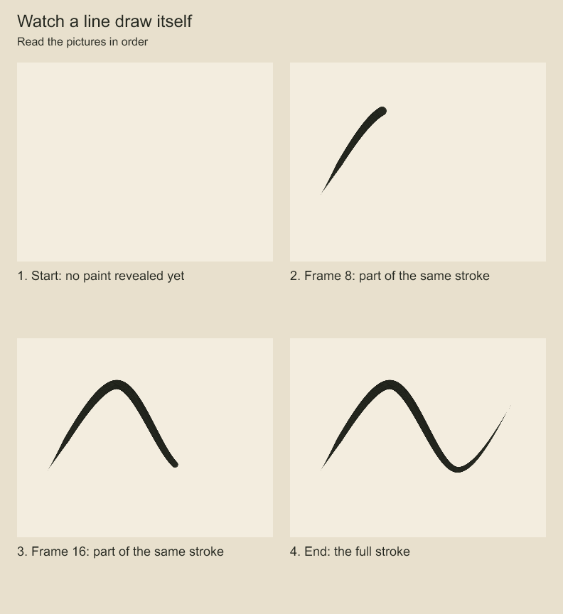

**Look for:** Follow the growing stroke from its first frame to the completed path.

Stroke reveal controls how much of the authored path is visible over time.

**Try:** Double the reveal duration while keeping the path unchanged.

[Read the source](src/studies/animation/stroke-reveal.ts) · [Play the clip](../../website/public/art/guides/stroke-reveal.mp4)

### Hold, change and leave a blank

What is visible between drawing keys?

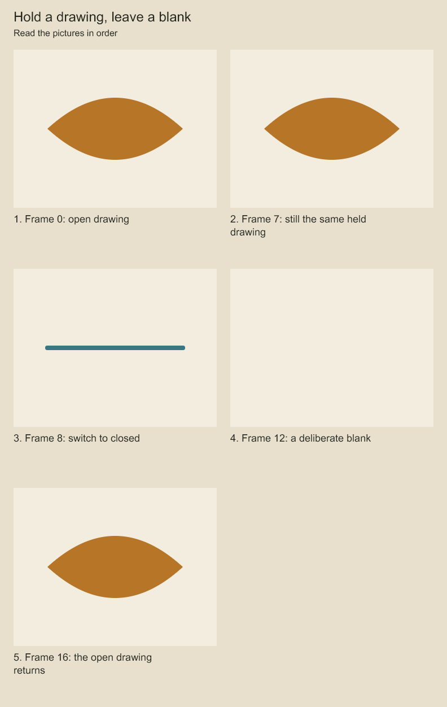

**Look for:** The open eye holds, the closed eye replaces it, then the explicitly blank exposure removes it.

A drawing key holds until the next key; a blank exposure is an authored state.

**Try:** Lengthen the closed-eye exposure by moving the next key.

[Read the source](src/studies/animation/drawing-holds.ts) · [Play the clip](../../website/public/art/guides/drawing-holds.mp4)

### Move the view, keep the drawing

How does a camera bring attention to one object?

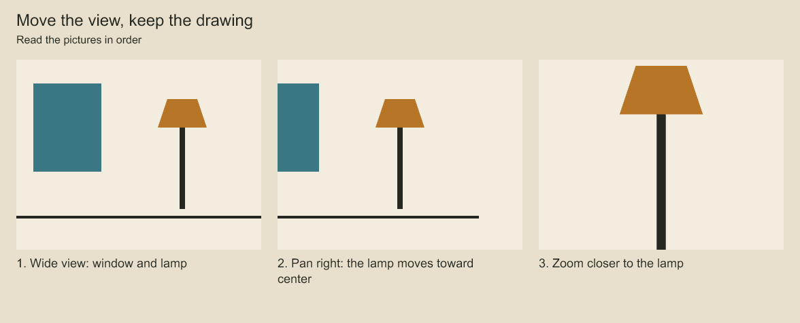

**Look for:** Compare the window and lamp as the camera pans right and zooms in.

Camera keys change the view of stationary artwork.

**Try:** Change only the final zoom and check whether the lamp remains visible.

[Read the source](src/studies/animation/camera-framing.ts) · [Play the clip](../../website/public/art/guides/camera-framing.mp4)

### Give the movement more time

What changes when a shot lasts twice as long?

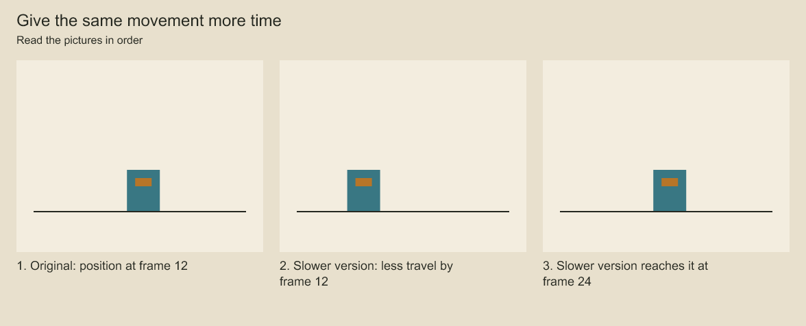

**Look for:** Compare both versions at frame 12, then compare the slower version at frame 24.

Retiming moves keys to a new time scale; it does not redraw the movement.

**Try:** Try a shorter duration and inspect the new key positions.

[Read the source](src/studies/animation/retiming.ts) · [Play the clip](../../website/public/art/guides/retiming.mp4)

## Make a change over time

Read the pictures in order. For motion, play the clip and watch the same part of the drawing throughout.

### Turn three solids around one pivot

How do the silhouettes change as the group turns?

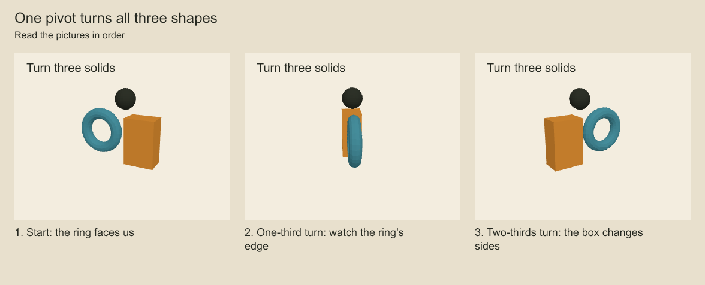

**Look for:** The ring becomes narrow when seen edge-on. The box and sphere keep their position relative to the same pivot, while the 2D title stays still.

The saved project retains the solids, camera, lighting, and rotation keys. Each frame projects the scene again.

**Try:** Open the saved scene, change the box material color with LayerHandle.edit, and render the same frames again.

[Read the source](src/studies/animation/scene-3d.ts) · [Play the clip](../../website/public/art/guides/scene-3d.mp4)

### Share a bend between two joints

Which part of the strip follows each joint?

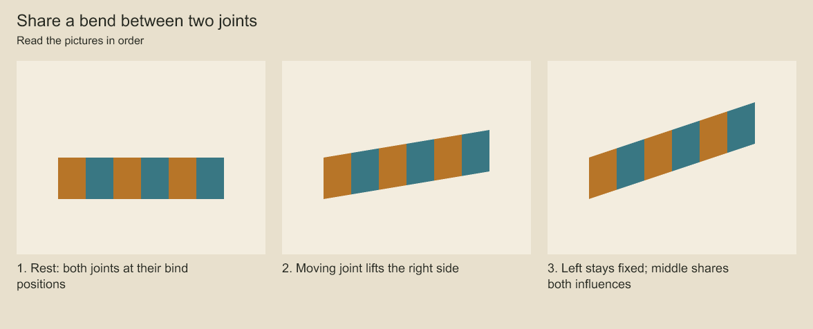

**Look for:** The left edge stays fixed, the right edge rises, and the middle moves halfway.

Explicit weights combine joint motion at each mesh vertex. No weights are generated automatically.

**Try:** Change the middle vertices from equal weights to 75 percent tip influence.

[Read the source](src/studies/animation/skin-weights.ts) · [Play the clip](../../website/public/art/guides/skin-weights.mp4)

### Bend a surface from its boundary

Can the border control the shape inside?

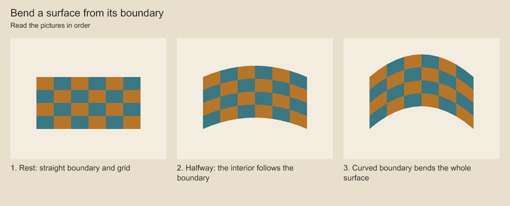

**Look for:** The woven grid follows the curved upper and lower edges. The side endpoints stay fixed.

An authored envelope generates a mesh that deforms the interior artwork.

**Try:** Change one boundary control point and inspect the grid.

[Read the source](src/studies/animation/envelope.ts) · [Play the clip](../../website/public/art/guides/envelope.mp4)

### Swap the drawing while it moves

Does a drawing change have to interrupt movement?

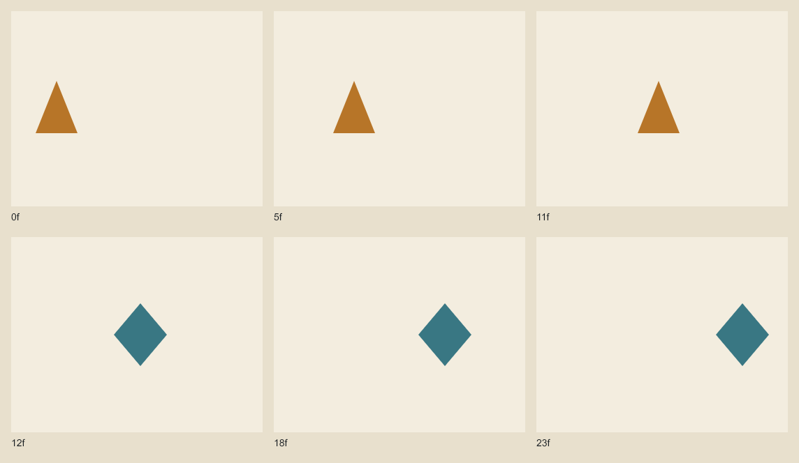

**Look for:** Compare frames 11 and 12. The triangle becomes a diamond immediately, while its travel to the right continues.

Drawing holds choose the silhouette. Position keys move the whole drawing independently.

**Try:** Move the drawing switch from frame 12 to frame 18. Keep the movement keys unchanged.

[Read the source](src/studies/animation/drawing-timing.ts) · [Play the clip](../../website/public/art/guides/drawing-timing.mp4)

### Move partway toward a pose

What does half of a position change look like?

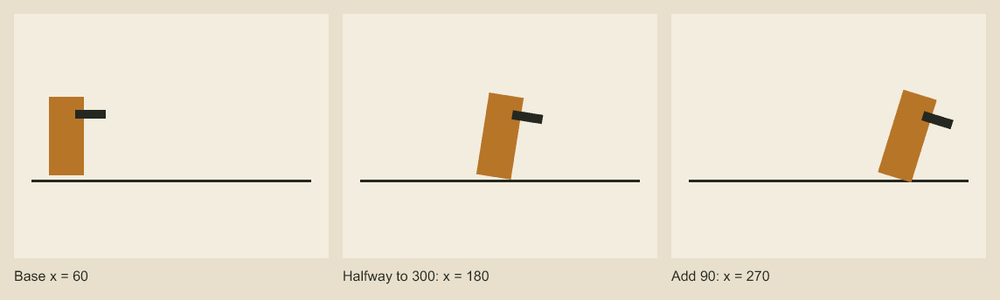

**Look for:** The marker starts at x = 60 and moves halfway toward x = 300, reaching x = 180. The final pose adds another 90.

A replacement weight blends toward a target. An additive pose applies an extra change to the current pose.

**Try:** Change the replacement weight from 0.5 to 1 and compare the middle position.

[Read the source](src/studies/animation/weighted-pose.ts) · [Play the clip](../../website/public/art/guides/weighted-pose.mp4)

### Can the hand reach the target?

What happens when a target is too far away?

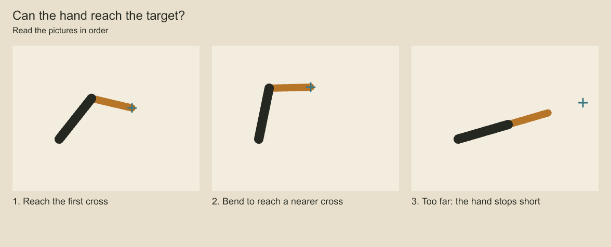

**Look for:** The cross marks the requested hand position. Compare the gap between the hand and cross in the last picture.

The arm can turn at its joints, but its two segment lengths limit its reach.

**Try:** Move the farthest target closer to the shoulder until the hand can reach it.

[Read the source](src/studies/animation/ik-reach.ts)

### Reach, then return to rest

How do you get back to the original arm pose?

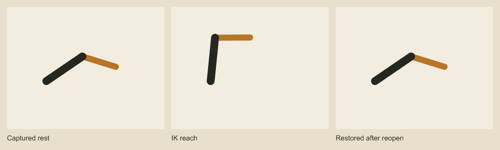

**Look for:** Compare the first and last arm positions. The middle picture shows the reach; the last restores the saved rest pose.

A stored rest pose provides a repeatable starting position for the rig.

**Try:** Change the reach target while keeping the captured rest pose. The return should stay the same.

[Read the source](src/studies/animation/rig-rest.ts) · [Play the clip](../../website/public/art/guides/rig-rest.mp4)

### Bend the artwork

Can an image bend without redrawing its contents?

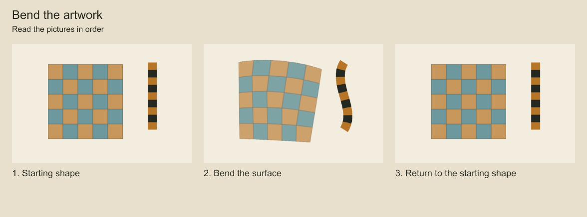

**Look for:** Follow the colored surface across the three poses. Its internal marks travel with the deformation.

A mesh moves the surface and the artwork together. The technical report also exercises copying and merging; the main comparison isolates the bend.

**Try:** Change a destination mesh vertex and render again. Watch which area of the artwork follows it.

[Read the source](src/studies/animation/mesh-warp.ts) · [Play the clip](../../website/public/art/guides/mesh-warp.mp4)

### Bend a transparent surface

Will a mesh create a seam through transparent paint?

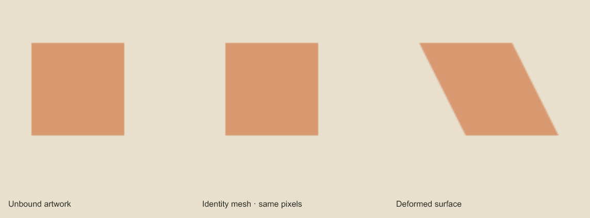

**Look for:** The first two squares should look the same. In the sheared square, look for an unwanted dark diagonal across the surface.

The shared triangle edge should not paint a transparent pixel twice. The background is included only to make transparency visible.

**Try:** Change the surface opacity and compare the center diagonal with the rest of the square.

[Read the source](src/studies/animation/mesh-alpha.ts) · [Play the clip](../../website/public/art/guides/mesh-alpha.mp4)

### Bend the stripes and their boundary

What happens to a mask when its artwork bends?

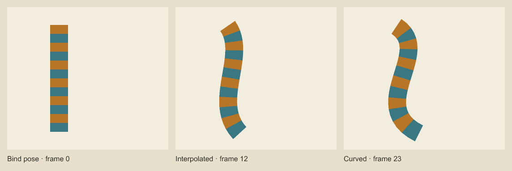

**Look for:** Follow the striped ribbon from straight to curved. The visible boundary bends with the stripes instead of cutting across them.

The deformation carries the artwork and mask together, even when the parent enlarges the drawing.

**Try:** Change the last curve control point and compare the outer edge with the stripes inside it.

[Read the source](src/studies/animation/deformer-resolution/render.ts) · [Play the clip](../../website/public/art/guides/deformer-resolution.mp4)

### Read a gesture across four shots

Can you follow who offers and who receives the card?

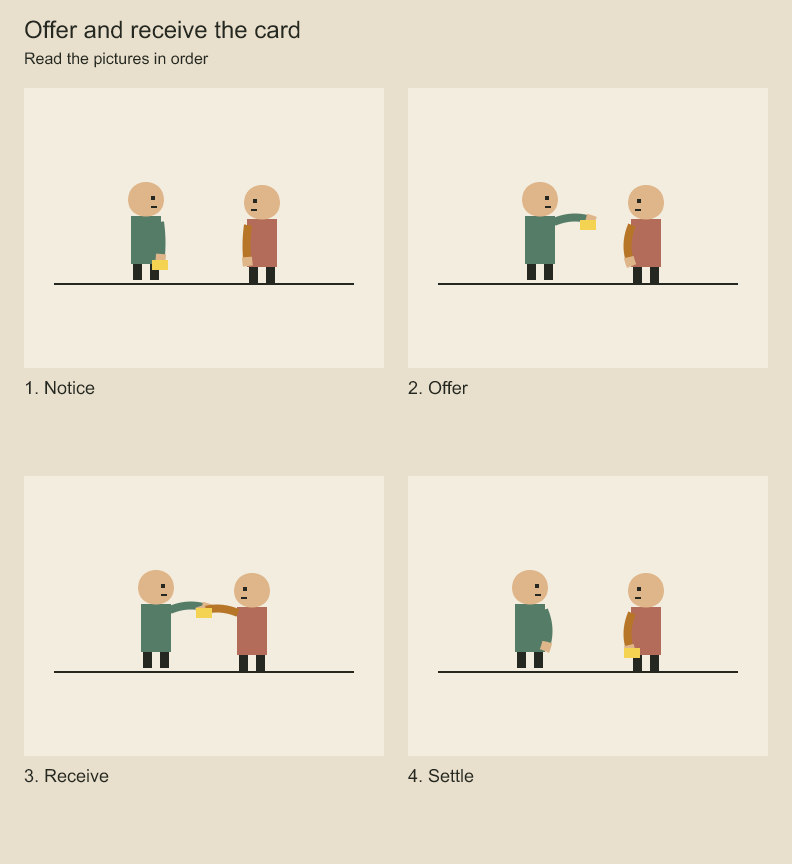

**Look for:** Watch the yellow card and the two hands: notice, offer, receive, then hold. Use the stills to compare each pose.

The sequence combines arm bends, position controls and held mouth drawings. The card path and mouth cues are authored explicitly.

**Try:** Lengthen the hold after the receiver takes the card. Watch whether the exchange becomes easier to read.

[Read the source](src/studies/animation/controller-exchange/author.ts) · [Play the clip](../../website/public/art/guides/controller-exchange.mp4)

### Hold a mouth shape, then correct it

How does a manual mouth correction affect the sequence?

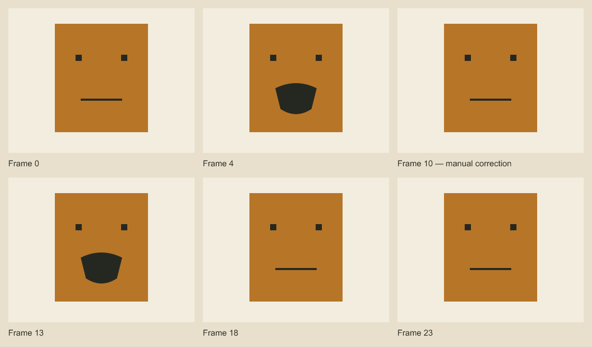

**Look for:** Read the mouth shapes in frame order. At frame 10, the authored correction replaces the automatic cue.

Mouth drawings are held over ranges of frames. A manual correction can preserve an intentional closure.

**Try:** Extend the manual closure by two frames, then replay the sequence. This sample has no recorded dialogue to judge synchronization against.

[Read the source](src/studies/animation/lip-sync.ts) · [Play the clip](../../website/public/art/guides/lip-sync.mp4)

### Near objects slide faster

How can a camera pan create a sense of depth?

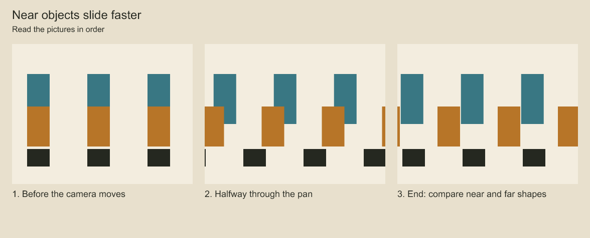

**Look for:** Track the dark foreground shapes, then the blue background shapes. The camera moves once, but the near shapes travel farther across the frame.

Depth changes apparent camera movement. The drawing coordinates remain fixed.

**Try:** Set every layer depth to 1. Compare that flat pan with the original.

[Read the source](src/studies/animation/camera-depth.ts) · [Play the clip](../../website/public/art/guides/camera-depth.mp4)

### Change the order of two shots

Can you reorder a sequence without redrawing either shot?

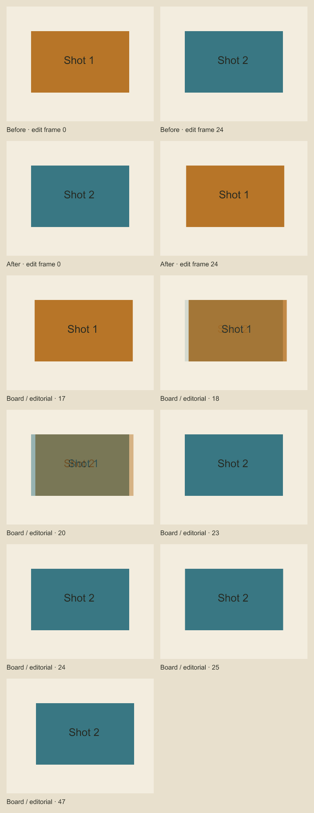

**Look for:** Read the first row left to right, then the second. The shot that was second now opens the sequence.

The edit chooses shot order and source ranges. Each shot's drawings remain its own source.

**Try:** Swap the clips back and change the trim on the first shot. Watch the cut in the exported sequence.

[Read the source](src/studies/animation/editorial-cuts.ts) · [Play the clip](../../website/public/art/guides/editorial-cuts.mp4)

## Reuse and bring artwork in

Compare what stays shared with what you can change in one copy.

### One lamp, three placements

Do you have to draw the lamp again at every size?

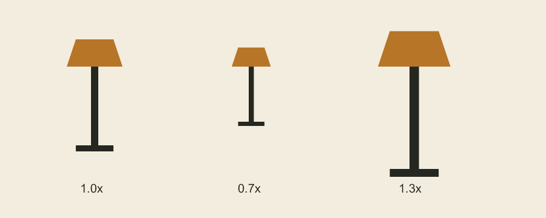

**Look for:** The lamps share their construction, but each has its own position and scale. Compare the shade, stem and base.

A reusable component supplies the drawing. Placed copies can have different transforms and local edits.

**Try:** Change the middle lamp's scale from 0.7 to 1.1. The other placements should stay put.

[Read the source](src/studies/assets/components.ts)

### Update the shape, keep your paint

What happens to a local color change when the source drawing changes?

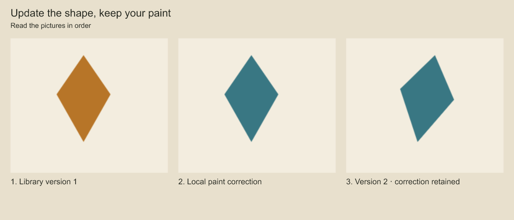

**Look for:** Compare the original, the locally repainted version and the updated shape. The local paint survives the geometry update.

Updating a component can bring in source changes while preserving independent corrections in a copy.

**Try:** Choose a different local paint color and rerun the source upgrade. Compare the new shape and the retained color separately.

[Read the source](src/studies/assets/component-upgrade/render.ts) · [Play the clip](../../website/public/art/guides/component-upgrade.mp4)

### Edit an imported pixel

Can an imported image remain editable?

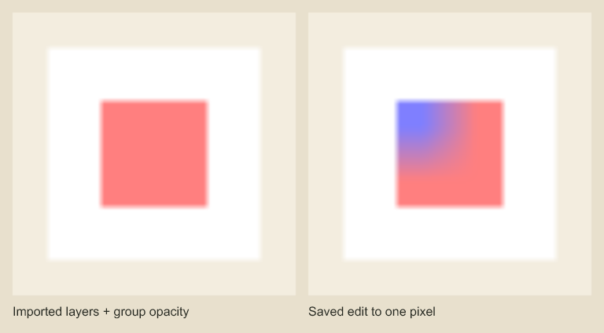

**Look for:** Compare the red area before and after import editing. The blue correction changes one source pixel, enlarged here so you can see it.

Supported PSD layers become native editable layers. The sample is intentionally tiny so one pixel is visible.

**Try:** Move the blue correction to a different source pixel and compare the enlarged result.

[Read the source](src/studies/assets/psd-import.ts)

## Organize the story

These diagrams explain structure and text. They do not generate illustrations from a script.

### Explain a move on the board

How can a still board communicate movement?

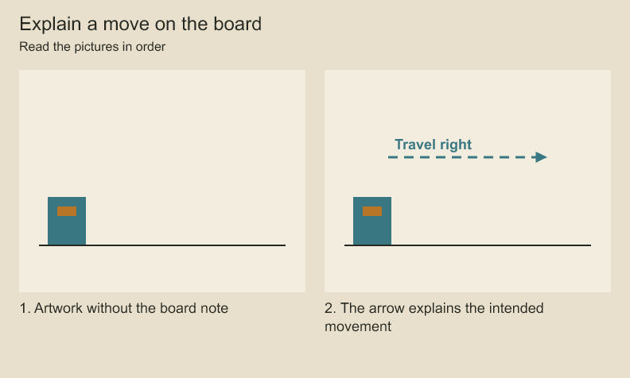

**Look for:** Only the second picture contains the labeled motion arrow.

A motion annotation describes intent. It does not animate the artwork.

**Try:** Change the arrow direction without changing any animation keys.

[Read the source](src/studies/story/motion-notes.ts)

### Where does a drawing live?

How do scenes, shots, panels and layers fit together?

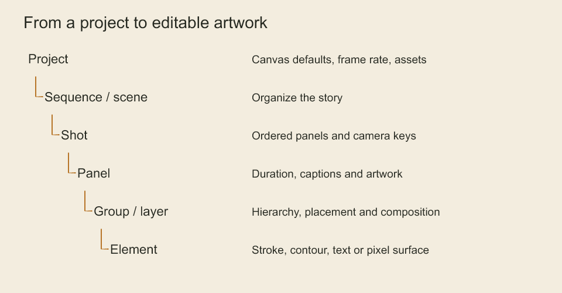

**Look for:** Read from the whole project toward individual artwork. Each level gives you a smaller part to organize or edit.

Story structure and drawing layers solve different problems. This is an explanatory diagram, not a rendered film.

**Try:** Open an example and find one scene, one shot, one panel and a layer inside that panel.

[Read the source](src/studies/story/hierarchy.ts)

### A script and a panel caption are separate

Does editing a caption rewrite the script?

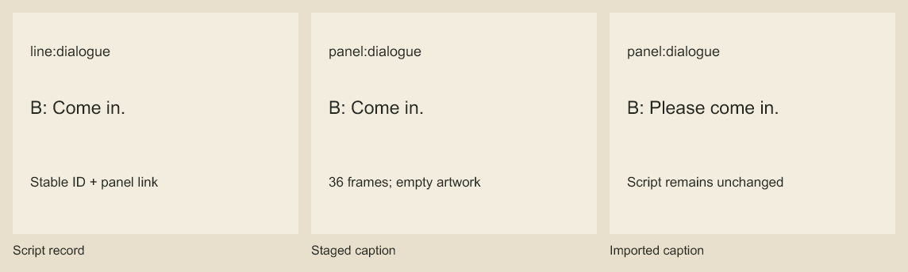

**Look for:** Read the dialogue in the source card, the staged caption and the revised caption. The source text stays unchanged.

Staging links script records to panels. A later caption edit changes the panel's text, not its original script record.

**Try:** Change the imported caption sentence and compare it with the source script card.

[Read the source](src/studies/story/script-board.ts)

## Place and hear sound

Start with the timeline diagram, then listen to the generated clips. Waveforms help locate sound; listening reveals the result.

### Choose the sound, then place it

What is the difference between trimming and moving audio?

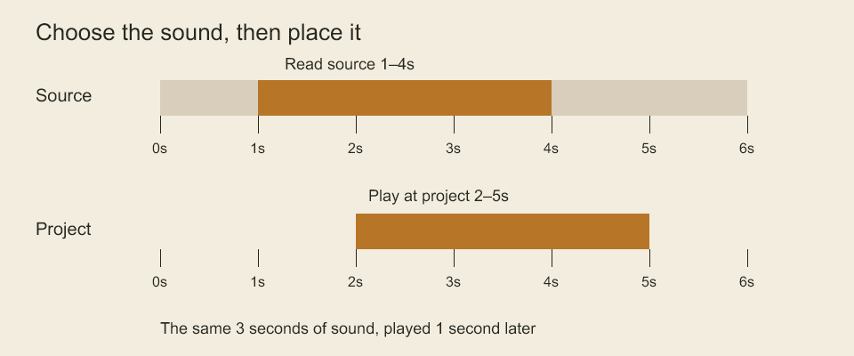

**Look for:** The source bar selects seconds 1 to 4. The project bar places that selection at seconds 2 to 5.

Trimming chooses which part of the recording you hear. Placement chooses when you hear it. This diagram itself is silent.

**Try:** Move the project start one second later without changing the source trim.

[Read the source](src/studies/audio/audio-placement.ts)

### Hear the cue inside the silence

Does the exported sound start and stop where you placed it?

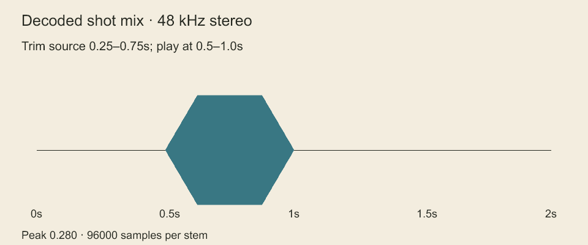

**Look for:** Play the two-second clip. Listen for the tone between 0.5 and 1 second, and compare that interval with the waveform.

The waveform comes from decoded mixed audio. The clip contains a generated tone, not speech.

**Try:** Move the cue later or extend its fade. Listen again before inspecting the measurements.

[Read the source](src/studies/audio/audio-delivery.ts) · [Play the clip](../../website/public/art/guides/audio-delivery.mp4)

### Replace a low tone with a high tone

Will reopening the project play the replacement sound?

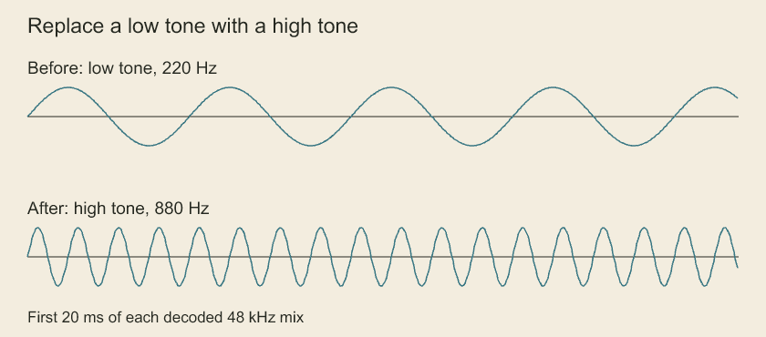

**Look for:** Compare the waves over the same time interval: the higher tone has more cycles. Play the replacement clip to hear it.

Replacing an audio asset changes the embedded sound used by the project. The technical checks also cover a missing replacement file.

**Try:** Change the replacement from 880 Hz to 440 Hz. Listen for the lower pitch and compare the waveform spacing.

[Read the source](src/studies/audio/asset-replacement.ts) · [Play the clip](../../website/public/art/guides/asset-replacement.mp4)

## Revise and deliver the work

Look for the intended change, or for an image that should stay identical. Technical reports are available after the visual explanation.

### Fit one picture into a wide frame

What should happen when the output shape changes?

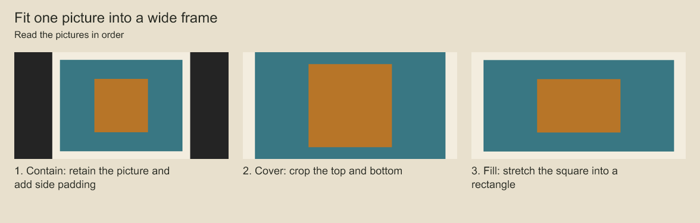

**Look for:** Compare side padding, cropped edges and the stretched central square.

Contain, cover and fill are different output choices, applied by real frame jobs.

**Try:** Change the output to a tall frame and compare the three policies.

[Read the source](src/studies/workflow/output-profiles.ts)

### Separate a prop from its background

Can one object be processed independently?

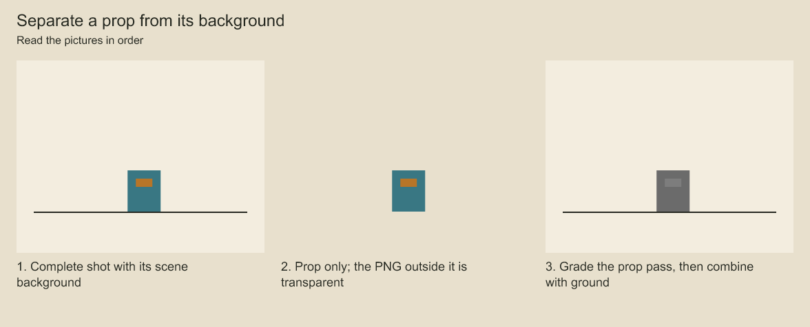

**Look for:** The isolated prop has no ground. The final image combines the desaturated prop with the original ground.

Layer selection creates a transparent pass; a saved graph can grade and combine passes.

**Try:** Grade only the prop with a brightness effect.

[Read the source](src/studies/workflow/render-passes.ts)

### Try a change and return to the original

Can you recover the drawing before an edit?

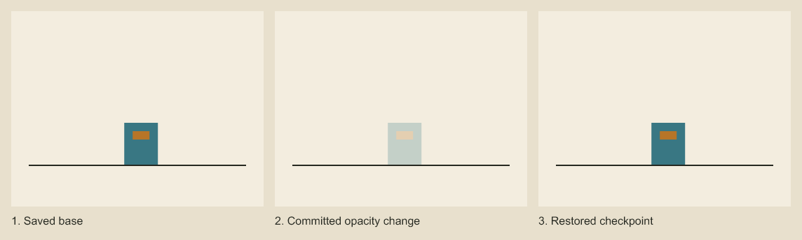

**Look for:** The prop becomes translucent in the middle image. The restored image returns to the opaque original.

A saved checkpoint lets you return to an earlier state after making a change.

**Try:** Use an opacity of 0.5 instead of 0.25, then restore the same checkpoint.

[Read the source](src/studies/workflow/saved-revision.ts)

### See motion without changing the drawing

What can review overlays reveal?

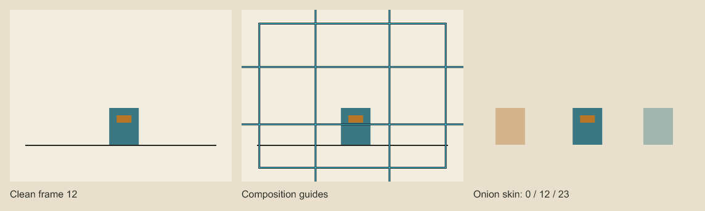

**Look for:** Compare the clean frame with composition guides and then the ghosted positions. The ghosts show where the prop was and where it is going.

Review overlays add information to an exported view while leaving the source artwork alone.

**Try:** Choose a different center frame for the onion skin. Compare the spacing between ghosted positions.

[Read the source](src/studies/workflow/review-tools.ts)

### Keep the title you intended

What changes when the requested font is missing?

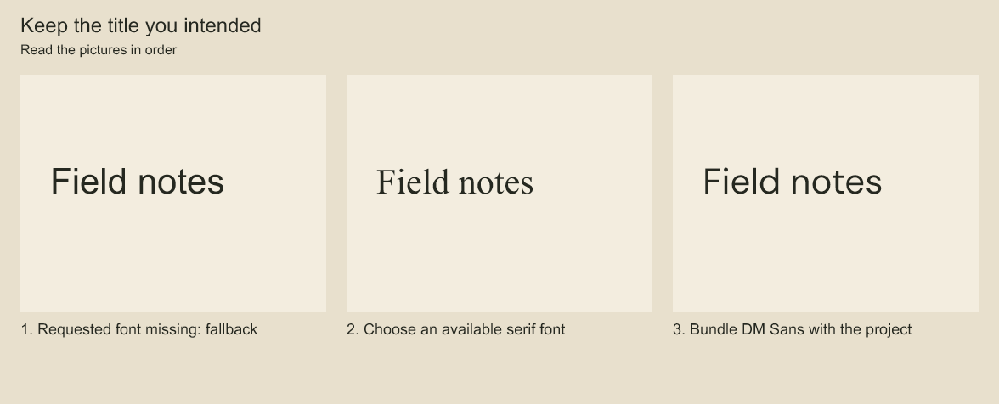

**Look for:** All samples say 'Field notes'. Compare letter shapes and spacing in the fallback, the chosen serif and the bundled font.

A fallback can keep text visible while changing its appearance. Checking or bundling a font makes the choice explicit.

**Try:** Change the title to a longer phrase and compare line width in each font.

[Read the source](src/studies/workflow/font-preflight.ts) · [Play the clip](../../website/public/art/guides/font-preflight.mp4)

### Continue an interrupted render

Must a stopped render start again from the first frame?

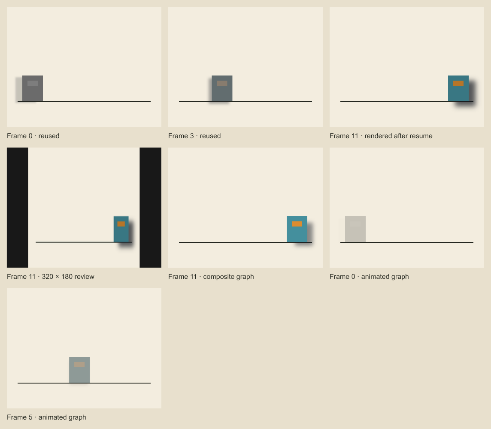

**Look for:** The first two samples were already rendered. The last comes from the resumed job. Their captions identify which work was kept.

The job retains completed frames and renders the remaining ones. Pictures show the output; the progress report records reuse.

**Try:** Stop after two completed frames instead of four. Inspect the resumed counts and the resulting images.

[Read the source](src/studies/workflow/frame-jobs.ts)

### Open an older project without changing its look

Does updating the file format change the drawing?

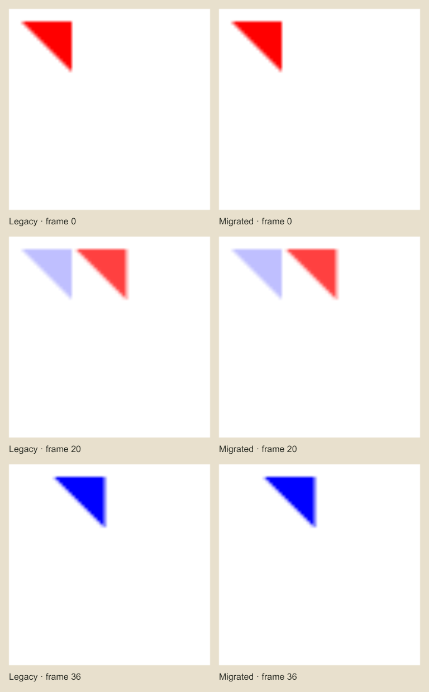

**Look for:** Compare each old frame with the converted frame next to it. Matching pairs are the intended result.

Migration writes a new project. These samples check that its selected frames preserve the old appearance.

**Try:** Compare another frame from the old and converted files before making a new edit.

[Read the source](src/studies/workflow/migration.ts)

### Hand off a project with its assets

Can the drawing survive when the original source paths disappear?

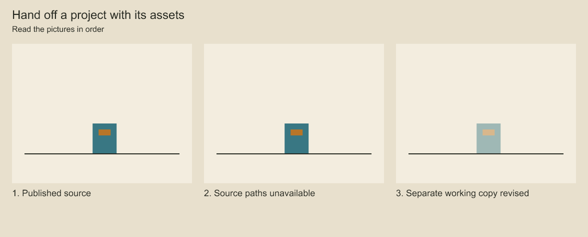

**Look for:** The first two images should match. The final image is an independent revision made in a working copy.

The handoff carries the required project assets. A separate working copy can then change without rewriting the delivery.

**Try:** Revise the working copy's opacity and compare it with the untouched handoff.

[Read the source](src/studies/workflow/project-publish.ts)

### Bring two edits back together

What survives when two people change the same shot?

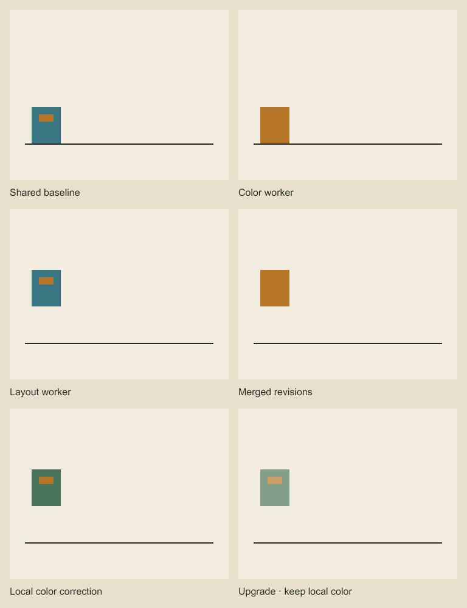

**Look for:** Compare the baseline, each separate edit and the merged result. First follow color and placement, then the local color correction and incoming opacity.

Independent changes can be combined. Conflicting changes need an explicit choice rather than silently replacing one person's work.

**Try:** Change the incoming opacity while keeping the local color correction, then compare the merged shot.

[Read the source](src/studies/workflow/shot-merge.ts) · [Play the clip](../../website/public/art/guides/shot-merge.mp4)

### Rebuild a sequence from a cut list

Which source picture appears at each point in an edit?

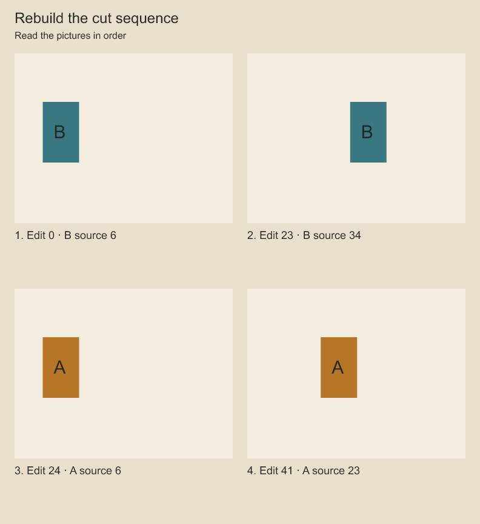

**Look for:** Read the samples in edit order. Each caption identifies the source shot and frame selected by the cut list.

The edit maps source ranges onto a timeline, including sources with different frame rates.

**Try:** Adjust one source-in value in the cut-list fixture and compare the first visible frame of that clip.

[Read the source](src/studies/workflow/otio-conform.ts) · [Play the clip](../../website/public/art/guides/otio-conform.mp4)

